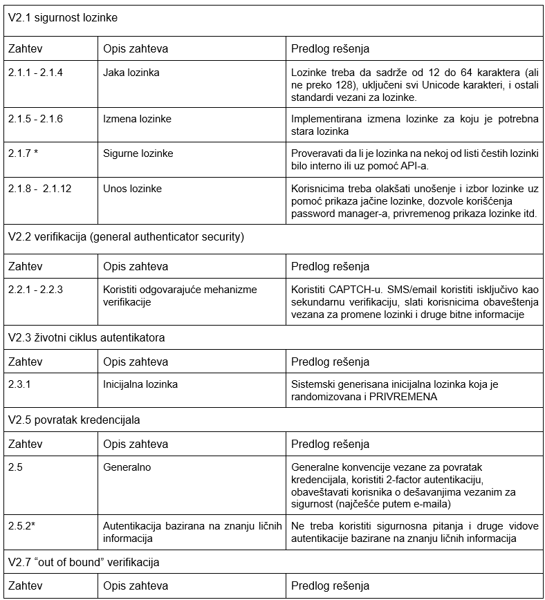
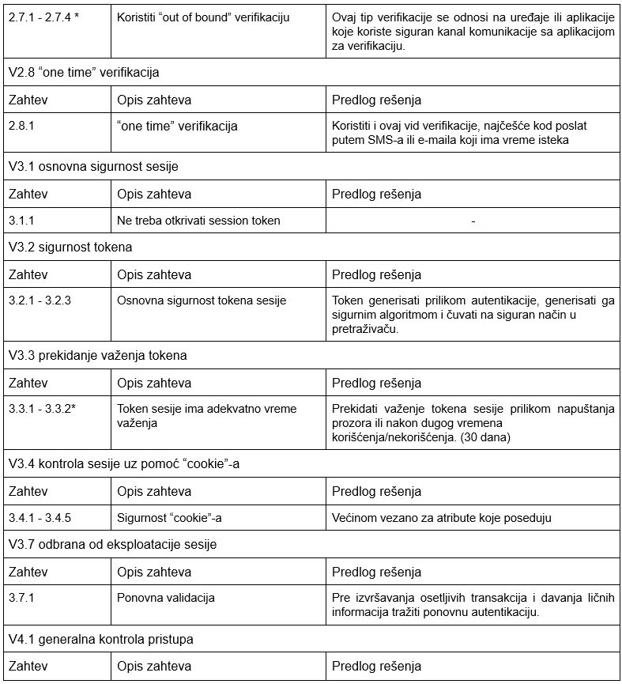
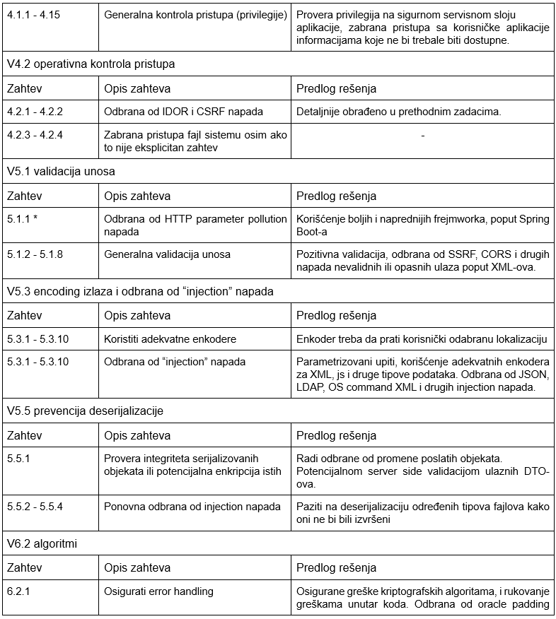
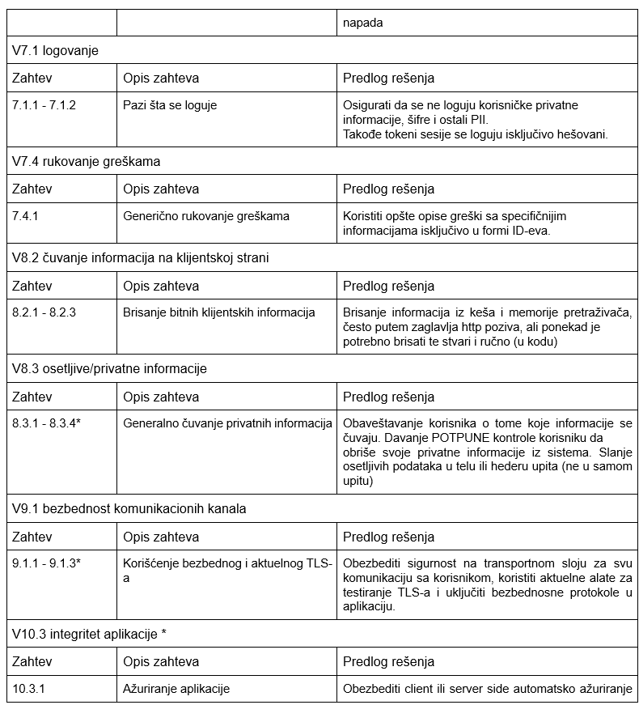
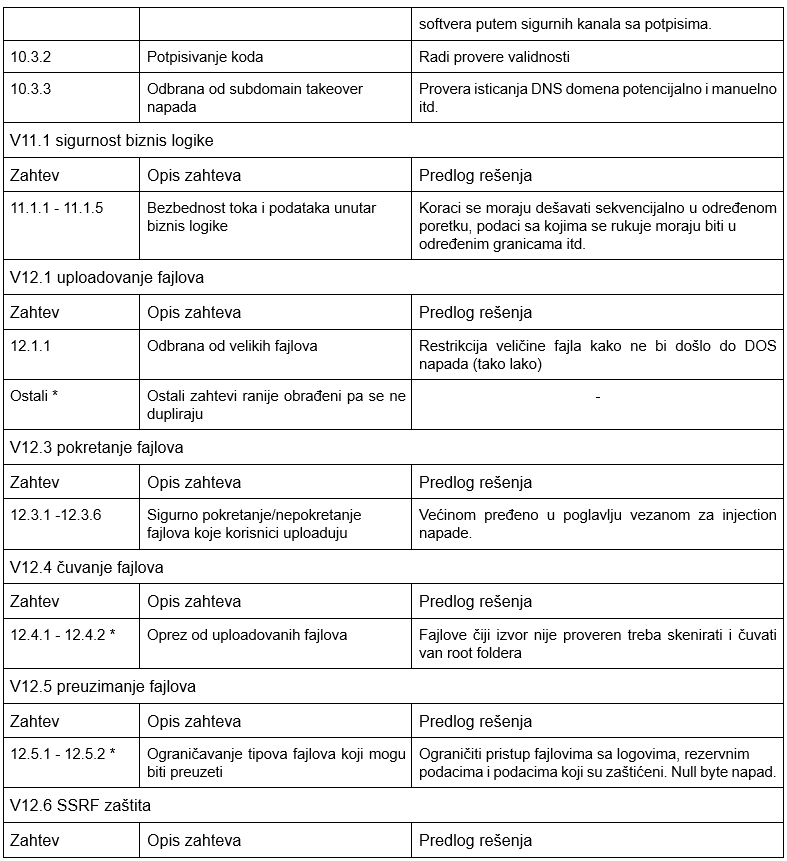
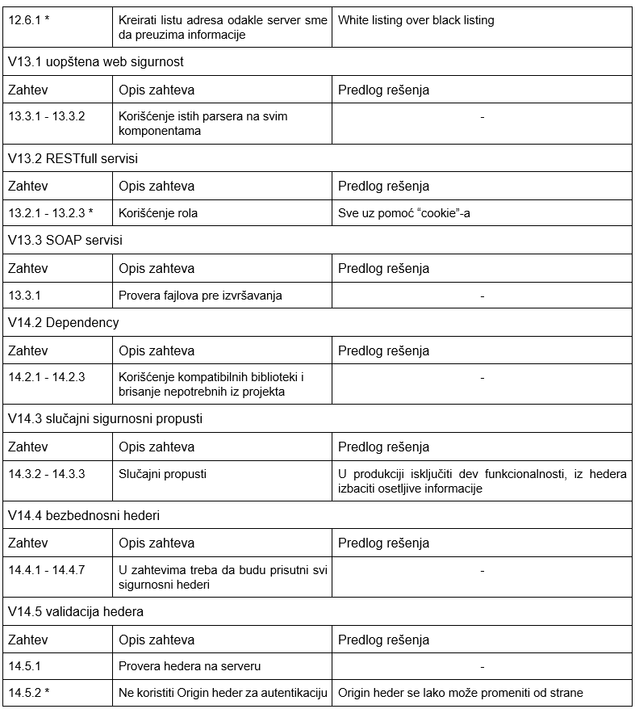
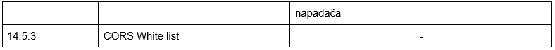

# MINI ZANZIBAR KONCEPT - APLIKACIJA ZA OTPREMANJE SLIKA

Korisnici se najpre registruju i loguju na naloge. Imaju mogućnost
otpremanja slika/videa, pri čemu definišu i ime i tagove pridružene
slici. Korisnik koji otprema slike ima rolu ***owner***-a. *Owner* može
da menja/dodaje/briše tagove i ime slike/videa, a **jedini** može
brisati slike/videa koje je otpremio. Takođe može da podeli prava
pristupa ostalim korisnicima aplikacije. Ukoliko daje pravo
izmene/dodele/brisanja tagova i imena slici, korisnik kome je podeljeno
pravo pristupa ima rolu ***editor***-a. Ukoliko daje samo pravo
pregleda, korisnik kome je podeljeno pravo pristupa ima rolu
***viewer***-a. Podeljena prava je moguće i izmeniti.

Aplikacija je namenjena da bude servirana preko ***Nginx***-a, tj.
uopštenije, bilo kog *reverse proxy*-ja koji je u mogućnosti da servira
i statički sadržaj.

## Konceptni model pretnji aplikacije

Akcije u kojima učestvuje (mini) Zanzibar su:

-   Dodavanje/izmena/dobavljanje *namespace* konfiguracije za relacije
    unutar sistema

-   Dodavanje/izmena/dobavljanje ACL-a (*Access Control List*) za
    sliku/video

## Procesni modeli pretnji aplikacije

   ### Dodavanje/izmena *Namespace* konfiguracije

### Dodavanje/izmena ACL-a za sliku/video

    
### Provera prava pristupa slici/videu

# Application Security Verification Standard: Report

OWASP Standard za verifikaciju bezbednosti aplikacija (ASVS) je
sveobuhvatan standard koji definiše osnovne zahteve za bezbednost veb
aplikacija. Standard je podeljen na tri nivoa bezbednosti, svaki sa
svojim ključnim zahtevima.

U narednom izveštaju, zahtevi će biti grupisani po nivoima, pa po
kategorijama radi preglednosti. Kako se mnogi zahtevi odnose na slične
stvari, oni će biti dalje grupisani radi konciznosti, a detaljniji opis
i predlog rešenja će se nalaziti u adekvatnoj koloni.

Verzija praćenog standarda je 4.0.3

## Level 1

Ovo je nivo sigurnosti koji treba da zadovoljava svaka moderna
aplikacija. Zahtevi u ovoj sekciji su relativno jednostavni, kako za
razumevanje, tako i za implementaciju.

Stoga, ovaj nivo sigurnosti će biti najdetaljnije obrađen.

## Level 2

Ovaj nivo sigurnosti po mojoj proceni nije u potpunosti potrebno
implementirati za ovu aplikaciju. Ono što je izostavljeno iz prvog nivoa
je izbor algoritama i implementacija/korišćenje proverenih podsistema
koji izvršavaju određene funkcije na standardan i proveren način.

Takođe se oslanja i na manuelnu proveru istih, jer kako je i naglašeno u
uputstvu, nije moguća provera celog sistema samo automatizovanim
alatima.
