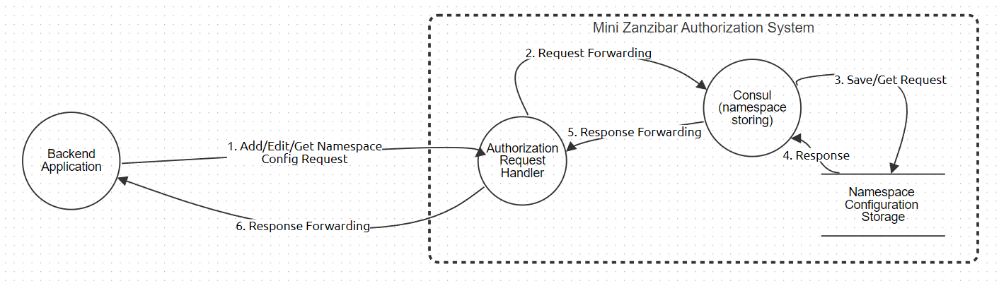

# MINI ZANZIBAR KONCEPT - APLIKACIJA ZA OTPREMANJE SLIKA

Korisnici se najpre registruju i loguju na naloge. Imaju mogućnost
otpremanja slika/videa, pri čemu definišu i ime i tagove pridružene
slici. Korisnik koji otprema slike ima rolu ***owner***-a. *Owner* može
da menja/dodaje/briše tagove i ime slike/videa, a **jedini** može
brisati slike/videa koje je otpremio. Takođe može da podeli prava
pristupa ostalim korisnicima aplikacije. Ukoliko daje pravo
izmene/dodele/brisanja tagova i imena slici, korisnik kome je podeljeno
pravo pristupa ima rolu ***editor***-a. Ukoliko daje samo pravo
pregleda, korisnik kome je podeljeno pravo pristupa ima rolu
***viewer***-a. Podeljena prava je moguće i izmeniti.

Aplikacija je namenjena da bude servirana preko ***Nginx***-a, tj.
uopštenije, bilo kog *reverse proxy*-ja koji je u mogućnosti da servira
i statički sadržaj.

## Konceptni model pretnji aplikacije

Akcije u kojima učestvuje (mini) Zanzibar su:

-   Dodavanje/izmena/dobavljanje *namespace* konfiguracije za relacije
    unutar sistema

-   Dodavanje/izmena/dobavljanje ACL-a (*Access Control List*) za
    sliku/video

## Procesni modeli pretnji aplikacije

   ### Dodavanje/izmena *Namespace* konfiguracije

### Dodavanje/izmena ACL-a za sliku/video

    
### Provera prava pristupa slici/videu

# Application Security Verification Standard: Report

OWASP Standard za verifikaciju bezbednosti aplikacija (ASVS) je
sveobuhvatan standard koji definiše osnovne zahteve za bezbednost veb
aplikacija. Standard je podeljen na tri nivoa bezbednosti, svaki sa
svojim ključnim zahtevima.

U narednom izveštaju, zahtevi će biti grupisani po nivoima, pa po
kategorijama radi preglednosti. Kako se mnogi zahtevi odnose na slične
stvari, oni će biti dalje grupisani radi konciznosti, a detaljniji opis
i predlog rešenja će se nalaziti u adekvatnoj koloni.

Verzija praćenog standarda je 4.0.3

## Level 1

Ovo je nivo sigurnosti koji treba da zadovoljava svaka moderna
aplikacija. Zahtevi u ovoj sekciji su relativno jednostavni, kako za
razumevanje, tako i za implementaciju.

Stoga, ovaj nivo sigurnosti će biti najdetaljnije obrađen.

+-----------+------------------------+---------------------------------+
| Level 1   |                        |                                 |
+===========+========================+=================================+
| V2.1      |                        |                                 |
| sigurnost |                        |                                 |
| lozinke   |                        |                                 |
+-----------+------------------------+---------------------------------+
| Zahtev    | Opis zahteva           | Predlog rešenja                 |
+-----------+------------------------+---------------------------------+
| 2.1.1 -   | Jaka lozinka           | Lozinke treba da sadrže od 12   |
| 2.1.4     |                        | do 64 karaktera (ali ne preko   |
|           |                        | 128), uključeni svi Unicode     |
|           |                        | karakteri, i ostali standardi   |
|           |                        | vezani za lozinke.              |
+-----------+------------------------+---------------------------------+
| 2.1.5 -   | Izmena lozinke         | Implementirana izmena lozinke   |
| 2.1.6     |                        | za koju je potrebna stara       |
|           |                        | lozinka                         |
+-----------+------------------------+---------------------------------+
| 2.1.7 \*  | Sigurne lozinke        | Proveravati da li je lozinka na |
|           |                        | nekoj od listi čestih lozinki   |
|           |                        | bilo interno ili uz pomoć       |
|           |                        | API-a.                          |
+-----------+------------------------+---------------------------------+
| 2.1.8 -   | Unos lozinke           | Korisnicima treba olakšati      |
| 2.1.12    |                        | unošenje i izbor lozinke uz     |
|           |                        | pomoć prikaza jačine lozinke,   |
|           |                        | dozvole korišćenja password     |
|           |                        | manager-a, privremenog prikaza  |
|           |                        | lozinke itd.                    |
+-----------+------------------------+---------------------------------+
| V2.2      |                        |                                 |
| ver       |                        |                                 |
| ifikacija |                        |                                 |
| (general  |                        |                                 |
| auth      |                        |                                 |
| enticator |                        |                                 |
| security) |                        |                                 |
+-----------+------------------------+---------------------------------+
| Zahtev    | Opis zahteva           | Predlog rešenja                 |
+-----------+------------------------+---------------------------------+
| 2.2.1 -   | Koristiti odgovarajuće | Koristiti CAPTCH-u. SMS/email   |
| 2.2.3     | mehanizme verifikacije | koristiti isključivo kao        |
|           |                        | sekundarnu verifikaciju, slati  |
|           |                        | korisnicima obaveštenja vezana  |
|           |                        | za promene lozinki i druge      |
|           |                        | bitne informacije               |
+-----------+------------------------+---------------------------------+
| V2.3      |                        |                                 |
| životni   |                        |                                 |
| ciklus    |                        |                                 |
| aute      |                        |                                 |
| ntikatora |                        |                                 |
+-----------+------------------------+---------------------------------+
| Zahtev    | Opis zahteva           | Predlog rešenja                 |
+-----------+------------------------+---------------------------------+
| 2.3.1     | Inicijalna lozinka     | Sistemski generisana inicijalna |
|           |                        | lozinka koja je randomizovana i |
|           |                        | PRIVREMENA                      |
+-----------+------------------------+---------------------------------+
| V2.5      |                        |                                 |
| povratak  |                        |                                 |
| kre       |                        |                                 |
| dencijala |                        |                                 |
+-----------+------------------------+---------------------------------+
| Zahtev    | Opis zahteva           | Predlog rešenja                 |
+-----------+------------------------+---------------------------------+
| 2.5       | Generalno              | Generalne konvencije vezane za  |
|           |                        | povratak kredencijala,          |
|           |                        | koristiti 2-factor              |
|           |                        | autentikaciju, obaveštavati     |
|           |                        | korisnika o dešavanjima vezanim |
|           |                        | za sigurnost (najčešće putem    |
|           |                        | e-maila)                        |
+-----------+------------------------+---------------------------------+
| 2.5.2\*   | Autentikacija bazirana | Ne treba koristiti sigurnosna   |
|           | na znanju ličnih       | pitanja i druge vidove          |
|           | informacija            | autentikacije bazirane na       |
|           |                        | znanju ličnih informacija       |
+-----------+------------------------+---------------------------------+
| V2.7 "out |                        |                                 |
| of bound" |                        |                                 |
| ver       |                        |                                 |
| ifikacija |                        |                                 |
+-----------+------------------------+---------------------------------+
| Zahtev    | Opis zahteva           | Predlog rešenja                 |
+-----------+------------------------+---------------------------------+
| 2.7.1 -   | Koristiti "out of      | Ovaj tip verifikacije se odnosi |
| 2.7.4 \*  | bound" verifikaciju    | na uređaje ili aplikacije koje  |
|           |                        | koriste siguran kanal           |
|           |                        | komunikacije sa aplikacijom za  |
|           |                        | verifikaciju.                   |
+-----------+------------------------+---------------------------------+
| V2.8 "one |                        |                                 |
| time"     |                        |                                 |
| ver       |                        |                                 |
| ifikacija |                        |                                 |
+-----------+------------------------+---------------------------------+
| Zahtev    | Opis zahteva           | Predlog rešenja                 |
+-----------+------------------------+---------------------------------+
| 2.8.1     | "one time"             | Koristiti i ovaj vid            |
|           | verifikacija           | verifikacije, najčešće kod      |
|           |                        | poslat putem SMS-a ili e-maila  |
|           |                        | koji ima vreme isteka           |
+-----------+------------------------+---------------------------------+
| V3.1      |                        |                                 |
| osnovna   |                        |                                 |
| sigurnost |                        |                                 |
| sesije    |                        |                                 |
+-----------+------------------------+---------------------------------+
| Zahtev    | Opis zahteva           | Predlog rešenja                 |
+-----------+------------------------+---------------------------------+
| 3.1.1     | Ne treba otkrivati     | \-                              |
|           | session token          |                                 |
+-----------+------------------------+---------------------------------+
| V3.2      |                        |                                 |
| sigurnost |                        |                                 |
| tokena    |                        |                                 |
+-----------+------------------------+---------------------------------+
| Zahtev    | Opis zahteva           | Predlog rešenja                 |
+-----------+------------------------+---------------------------------+
| 3.2.1 -   | Osnovna sigurnost      | Token generisati prilikom       |
| 3.2.3     | tokena sesije          | autentikacije, generisati ga    |
|           |                        | sigurnim algoritmom i čuvati na |
|           |                        | siguran način u pretraživaču.   |
+-----------+------------------------+---------------------------------+
| V3.3      |                        |                                 |
| p         |                        |                                 |
| rekidanje |                        |                                 |
| važenja   |                        |                                 |
| tokena    |                        |                                 |
+-----------+------------------------+---------------------------------+
| Zahtev    | Opis zahteva           | Predlog rešenja                 |
+-----------+------------------------+---------------------------------+
| 3.3.1 -   | Token sesije ima       | Prekidati važenje tokena sesije |
| 3.3.2\*   | adekvatno vreme        | prilikom napuštanja prozora ili |
|           | važenja                | nakon dugog vremena             |
|           |                        | korišćenja/nekorišćenja. (30    |
|           |                        | dana)                           |
+-----------+------------------------+---------------------------------+
| V3.4      |                        |                                 |
| kontrola  |                        |                                 |
| sesije uz |                        |                                 |
| pomoć     |                        |                                 |
| "         |                        |                                 |
| cookie"-a |                        |                                 |
+-----------+------------------------+---------------------------------+
| Zahtev    | Opis zahteva           | Predlog rešenja                 |
+-----------+------------------------+---------------------------------+
| 3.4.1 -   | Sigurnost "cookie"-a   | Većinom vezano za atribute koje |
| 3.4.5     |                        | poseduju                        |
+-----------+------------------------+---------------------------------+
| V3.7      |                        |                                 |
| odbrana   |                        |                                 |
| od        |                        |                                 |
| eksp      |                        |                                 |
| loatacije |                        |                                 |
| sesije    |                        |                                 |
+-----------+------------------------+---------------------------------+
| Zahtev    | Opis zahteva           | Predlog rešenja                 |
+-----------+------------------------+---------------------------------+
| 3.7.1     | Ponovna validacija     | Pre izvršavanja osetljivih      |
|           |                        | transakcija i davanja ličnih    |
|           |                        | informacija tražiti ponovnu     |
|           |                        | autentikaciju.                  |
+-----------+------------------------+---------------------------------+
| V4.1      |                        |                                 |
| generalna |                        |                                 |
| kontrola  |                        |                                 |
| pristupa  |                        |                                 |
+-----------+------------------------+---------------------------------+
| Zahtev    | Opis zahteva           | Predlog rešenja                 |
+-----------+------------------------+---------------------------------+
| 4.1.1 -   | Generalna kontrola     | Provera privilegija na sigurnom |
| 4.15      | pristupa (privilegije) | servisnom sloju aplikacije,     |
|           |                        | zabrana pristupa sa korisničke  |
|           |                        | aplikacije informacijama koje   |
|           |                        | ne bi trebale biti dostupne.    |
+-----------+------------------------+---------------------------------+
| V4.2      |                        |                                 |
| o         |                        |                                 |
| perativna |                        |                                 |
| kontrola  |                        |                                 |
| pristupa  |                        |                                 |
+-----------+------------------------+---------------------------------+
| Zahtev    | Opis zahteva           | Predlog rešenja                 |
+-----------+------------------------+---------------------------------+
| 4.2.1 -   | Odbrana od IDOR i CSRF | Detaljnije obrađeno u           |
| 4.2.2     | napada                 | prethodnim zadacima.            |
+-----------+------------------------+---------------------------------+
| 4.2.3 -   | Zabrana pristupa fajl  | \-                              |
| 4.2.4     | sistemu osim ako to    |                                 |
|           | nije eksplicitan       |                                 |
|           | zahtev                 |                                 |
+-----------+------------------------+---------------------------------+
| V5.1      |                        |                                 |
| v         |                        |                                 |
| alidacija |                        |                                 |
| unosa     |                        |                                 |
+-----------+------------------------+---------------------------------+
| Zahtev    | Opis zahteva           | Predlog rešenja                 |
+-----------+------------------------+---------------------------------+
| 5.1.1 \*  | Odbrana od HTTP        | Korišćenje boljih i naprednijih |
|           | parameter pollution    | frejmworka, poput Spring Boot-a |
|           | napada                 |                                 |
+-----------+------------------------+---------------------------------+
| 5.1.2 -   | Generalna validacija   | Pozitivna validacija, odbrana   |
| 5.1.8     | unosa                  | od SSRF, CORS i drugih napada   |
|           |                        | nevalidnih ili opasnih ulaza    |
|           |                        | poput XML-ova.                  |
+-----------+------------------------+---------------------------------+
| V5.3      |                        |                                 |
| encoding  |                        |                                 |
| izlaza i  |                        |                                 |
| odbrana   |                        |                                 |
| od        |                        |                                 |
| "i        |                        |                                 |
| njection" |                        |                                 |
| napada    |                        |                                 |
+-----------+------------------------+---------------------------------+
| Zahtev    | Opis zahteva           | Predlog rešenja                 |
+-----------+------------------------+---------------------------------+
| 5.3.1 -   | Koristiti adekvatne    | Enkoder treba da prati          |
| 5.3.10    | enkodere               | korisnički odabranu             |
|           |                        | lokalizaciju                    |
+-----------+------------------------+---------------------------------+
| 5.3.1 -   | Odbrana od "injection" | Parametrizovani upiti,          |
| 5.3.10    | napada                 | korišćenje adekvatnih enkodera  |
|           |                        | za XML, js i druge tipove       |
|           |                        | podataka. Odbrana od JSON,      |
|           |                        | LDAP, OS command XML i drugih   |
|           |                        | injection napada.               |
+-----------+------------------------+---------------------------------+
| V5.5      |                        |                                 |
| p         |                        |                                 |
| revencija |                        |                                 |
| deserij   |                        |                                 |
| alizacije |                        |                                 |
+-----------+------------------------+---------------------------------+
| Zahtev    | Opis zahteva           | Predlog rešenja                 |
+-----------+------------------------+---------------------------------+
| 5.5.1     | Provera integriteta    | Radi odbrane od promene         |
|           | serijalizovanih        | poslatih objekata.              |
|           | objekata ili           | Potencijalnom server side       |
|           | potencijalna           | validacijom ulaznih DTO-ova.    |
|           | enkripcija istih       |                                 |
+-----------+------------------------+---------------------------------+
| 5.5.2 -   | Ponovna odbrana od     | Paziti na deserijalizaciju      |
| 5.5.4     | injection napada       | određenih tipova fajlova kako   |
|           |                        | oni ne bi bili izvršeni         |
+-----------+------------------------+---------------------------------+
| V6.2      |                        |                                 |
| algoritmi |                        |                                 |
+-----------+------------------------+---------------------------------+
| Zahtev    | Opis zahteva           | Predlog rešenja                 |
+-----------+------------------------+---------------------------------+
| 6.2.1     | Osigurati error        | Osigurane greške kriptografskih |
|           | handling               | algoritama, i rukovanje         |
|           |                        | greškama unutar koda. Odbrana   |
|           |                        | od oracle padding napada        |
+-----------+------------------------+---------------------------------+
| V7.1      |                        |                                 |
| logovanje |                        |                                 |
+-----------+------------------------+---------------------------------+
| Zahtev    | Opis zahteva           | Predlog rešenja                 |
+-----------+------------------------+---------------------------------+
| 7.1.1 -   | Pazi šta se loguje     | Osigurati da se ne loguju       |
| 7.1.2     |                        | korisničke privatne             |
|           |                        | informacije, šifre i ostali     |
|           |                        | PII.                            |
|           |                        |                                 |
|           |                        | Takođe tokeni sesije se loguju  |
|           |                        | isključivo hešovani.            |
+-----------+------------------------+---------------------------------+
| V7.4      |                        |                                 |
| rukovanje |                        |                                 |
| greškama  |                        |                                 |
+-----------+------------------------+---------------------------------+
| Zahtev    | Opis zahteva           | Predlog rešenja                 |
+-----------+------------------------+---------------------------------+
| 7.4.1     | Generično rukovanje    | Koristiti opšte opise greški sa |
|           | greškama               | specifičnijim informacijama     |
|           |                        | isključivo u formi ID-eva.      |
+-----------+------------------------+---------------------------------+
| V8.2      |                        |                                 |
| čuvanje   |                        |                                 |
| in        |                        |                                 |
| formacija |                        |                                 |
| na        |                        |                                 |
| kl        |                        |                                 |
| ijentskoj |                        |                                 |
| strani    |                        |                                 |
+-----------+------------------------+---------------------------------+
| Zahtev    | Opis zahteva           | Predlog rešenja                 |
+-----------+------------------------+---------------------------------+
| 8.2.1 -   | Brisanje bitnih        | Brisanje informacija iz keša i  |
| 8.2.3     | klijentskih            | memorije pretraživača, često    |
|           | informacija            | putem zaglavlja http poziva,    |
|           |                        | ali ponekad je potrebno brisati |
|           |                        | te stvari i ručno (u kodu)      |
+-----------+------------------------+---------------------------------+
| V8.3      |                        |                                 |
| osetljive |                        |                                 |
| /privatne |                        |                                 |
| in        |                        |                                 |
| formacije |                        |                                 |
+-----------+------------------------+---------------------------------+
| Zahtev    | Opis zahteva           | Predlog rešenja                 |
+-----------+------------------------+---------------------------------+
| 8.3.1 -   | Generalno čuvanje      | Obaveštavanje korisnika o tome  |
| 8.3.4\*   | privatnih informacija  | koje informacije se čuvaju.     |
|           |                        | Davanje POTPUNE kontrole        |
|           |                        | korisniku da obriše svoje       |
|           |                        | privatne informacije iz         |
|           |                        | sistema. Slanje osetljivih      |
|           |                        | podataka u telu ili hederu      |
|           |                        | upita (ne u samom upitu)        |
+-----------+------------------------+---------------------------------+
| V9.1      |                        |                                 |
| b         |                        |                                 |
| ezbednost |                        |                                 |
| komun     |                        |                                 |
| ikacionih |                        |                                 |
| kanala    |                        |                                 |
+-----------+------------------------+---------------------------------+
| Zahtev    | Opis zahteva           | Predlog rešenja                 |
+-----------+------------------------+---------------------------------+
| 9.1.1 -   | Korišćenje bezbednog i | Obezbediti sigurnost na         |
| 9.1.3\*   | aktuelnog TLS-a        | transportnom sloju za svu       |
|           |                        | komunikaciju sa korisnikom,     |
|           |                        | koristiti aktuelne alate za     |
|           |                        | testiranje TLS-a i uključiti    |
|           |                        | bezbednosne protokole u         |
|           |                        | aplikaciju.                     |
+-----------+------------------------+---------------------------------+
| V10.3     |                        |                                 |
| i         |                        |                                 |
| ntegritet |                        |                                 |
| a         |                        |                                 |
| plikacije |                        |                                 |
| \*        |                        |                                 |
+-----------+------------------------+---------------------------------+
| Zahtev    | Opis zahteva           | Predlog rešenja                 |
+-----------+------------------------+---------------------------------+
| 10.3.1    | Ažuriranje aplikacije  | Obezbediti client ili server    |
|           |                        | side automatsko ažuriranje      |
|           |                        | softvera putem sigurnih kanala  |
|           |                        | sa potpisima.                   |
+-----------+------------------------+---------------------------------+
| 10.3.2    | Potpisivanje koda      | Radi provere validnosti         |
+-----------+------------------------+---------------------------------+
| 10.3.3    | Odbrana od subdomain   | Provera isticanja DNS domena    |
|           | takeover napada        | potencijalno i manuelno itd.    |
+-----------+------------------------+---------------------------------+
| V11.1     |                        |                                 |
| sigurnost |                        |                                 |
| biznis    |                        |                                 |
| logike    |                        |                                 |
+-----------+------------------------+---------------------------------+
| Zahtev    | Opis zahteva           | Predlog rešenja                 |
+-----------+------------------------+---------------------------------+
| 11.1.1 -  | Bezbednost toka i      | Koraci se moraju dešavati       |
| 11.1.5    | podataka unutar biznis | sekvencijalno u određenom       |
|           | logike                 | poretku, podaci sa kojima se    |
|           |                        | rukuje moraju biti u određenim  |
|           |                        | granicama itd.                  |
+-----------+------------------------+---------------------------------+
| V12.1     |                        |                                 |
| upl       |                        |                                 |
| oadovanje |                        |                                 |
| fajlova   |                        |                                 |
+-----------+------------------------+---------------------------------+
| Zahtev    | Opis zahteva           | Predlog rešenja                 |
+-----------+------------------------+---------------------------------+
| 12.1.1    | Odbrana od velikih     | Restrikcija veličine fajla kako |
|           | fajlova                | ne bi došlo do DOS napada (tako |
|           |                        | lako)                           |
+-----------+------------------------+---------------------------------+
| Ostali \* | Ostali zahtevi ranije  | \-                              |
|           | obrađeni pa se ne      |                                 |
|           | dupliraju              |                                 |
+-----------+------------------------+---------------------------------+
| V12.3     |                        |                                 |
| p         |                        |                                 |
| okretanje |                        |                                 |
| fajlova   |                        |                                 |
+-----------+------------------------+---------------------------------+
| Zahtev    | Opis zahteva           | Predlog rešenja                 |
+-----------+------------------------+---------------------------------+
| 12.3.1    | Sigurno                | Većinom pređeno u poglavlju     |
| -12.3.6   | p                      | vezanom za injection napade.    |
|           | okretanje/nepokretanje |                                 |
|           | fajlova koje korisnici |                                 |
|           | uploaduju              |                                 |
+-----------+------------------------+---------------------------------+
| V12.4     |                        |                                 |
| čuvanje   |                        |                                 |
| fajlova   |                        |                                 |
+-----------+------------------------+---------------------------------+
| Zahtev    | Opis zahteva           | Predlog rešenja                 |
+-----------+------------------------+---------------------------------+
| 12.4.1 -  | Oprez od uploadovanih  | Fajlove čiji izvor nije         |
| 12.4.2 \* | fajlova                | proveren treba skenirati i      |
|           |                        | čuvati van root foldera         |
+-----------+------------------------+---------------------------------+
| V12.5     |                        |                                 |
| pr        |                        |                                 |
| euzimanje |                        |                                 |
| fajlova   |                        |                                 |
+-----------+------------------------+---------------------------------+
| Zahtev    | Opis zahteva           | Predlog rešenja                 |
+-----------+------------------------+---------------------------------+
| 12.5.1 -  | Ograničavanje tipova   | Ograničiti pristup fajlovima sa |
| 12.5.2 \* | fajlova koji mogu biti | logovima, rezervnim podacima i  |
|           | preuzeti               | podacima koji su zaštićeni.     |
|           |                        | Null byte napad.                |
+-----------+------------------------+---------------------------------+
| V12.6     |                        |                                 |
| SSRF      |                        |                                 |
| zaštita   |                        |                                 |
+-----------+------------------------+---------------------------------+
| Zahtev    | Opis zahteva           | Predlog rešenja                 |
+-----------+------------------------+---------------------------------+
| 12.6.1 \* | Kreirati listu adresa  | White listing over black        |
|           | odakle server sme da   | listing                         |
|           | preuzima informacije   |                                 |
+-----------+------------------------+---------------------------------+
| V13.1     |                        |                                 |
| uopštena  |                        |                                 |
| web       |                        |                                 |
| sigurnost |                        |                                 |
+-----------+------------------------+---------------------------------+
| Zahtev    | Opis zahteva           | Predlog rešenja                 |
+-----------+------------------------+---------------------------------+
| 13.3.1 -  | Korišćenje istih       | \-                              |
| 13.3.2    | parsera na svim        |                                 |
|           | komponentama           |                                 |
+-----------+------------------------+---------------------------------+
| V13.2     |                        |                                 |
| RESTfull  |                        |                                 |
| servisi   |                        |                                 |
+-----------+------------------------+---------------------------------+
| Zahtev    | Opis zahteva           | Predlog rešenja                 |
+-----------+------------------------+---------------------------------+
| 13.2.1 -  | Korišćenje rola        | Sve uz pomoć "cookie"-a         |
| 13.2.3 \* |                        |                                 |
+-----------+------------------------+---------------------------------+
| V13.3     |                        |                                 |
| SOAP      |                        |                                 |
| servisi   |                        |                                 |
+-----------+------------------------+---------------------------------+
| Zahtev    | Opis zahteva           | Predlog rešenja                 |
+-----------+------------------------+---------------------------------+
| 13.3.1    | Provera fajlova pre    | \-                              |
|           | izvršavanja            |                                 |
+-----------+------------------------+---------------------------------+
| V14.2     |                        |                                 |
| D         |                        |                                 |
| ependency |                        |                                 |
+-----------+------------------------+---------------------------------+
| Zahtev    | Opis zahteva           | Predlog rešenja                 |
+-----------+------------------------+---------------------------------+
| 14.2.1 -  | Korišćenje             | \-                              |
| 14.2.3    | kompatibilnih          |                                 |
|           | biblioteki i brisanje  |                                 |
|           | nepotrebnih iz         |                                 |
|           | projekta               |                                 |
+-----------+------------------------+---------------------------------+
| V14.3     |                        |                                 |
| slučajni  |                        |                                 |
| s         |                        |                                 |
| igurnosni |                        |                                 |
| propusti  |                        |                                 |
+-----------+------------------------+---------------------------------+
| Zahtev    | Opis zahteva           | Predlog rešenja                 |
+-----------+------------------------+---------------------------------+
| 14.3.2 -  | Slučajni propusti      | U produkciji isključiti dev     |
| 14.3.3    |                        | funkcionalnosti, iz hedera      |
|           |                        | izbaciti osetljive informacije  |
+-----------+------------------------+---------------------------------+
| V14.4     |                        |                                 |
| be        |                        |                                 |
| zbednosni |                        |                                 |
| hederi    |                        |                                 |
+-----------+------------------------+---------------------------------+
| Zahtev    | Opis zahteva           | Predlog rešenja                 |
+-----------+------------------------+---------------------------------+
| 14.4.1 -  | U zahtevima treba da   | \-                              |
| 14.4.7    | budu prisutni svi      |                                 |
|           | sigurnosni hederi      |                                 |
+-----------+------------------------+---------------------------------+
| V14.5     |                        |                                 |
| v         |                        |                                 |
| alidacija |                        |                                 |
| hedera    |                        |                                 |
+-----------+------------------------+---------------------------------+
| Zahtev    | Opis zahteva           | Predlog rešenja                 |
+-----------+------------------------+---------------------------------+
| 14.5.1    | Provera hedera na      | \-                              |
|           | serveru                |                                 |
+-----------+------------------------+---------------------------------+
| 14.5.2 \* | Ne koristiti Origin    | Origin heder se lako može       |
|           | heder za autentikaciju | promeniti od strane napadača    |
+-----------+------------------------+---------------------------------+
| 14.5.3    | CORS White list        | \-                              |
+-----------+------------------------+---------------------------------+

## Level 2

Ovaj nivo sigurnosti po mojoj proceni nije u potpunosti potrebno
implementirati za ovu aplikaciju. Ono što je izostavljeno iz prvog nivoa
je izbor algoritama i implementacija/korišćenje proverenih podsistema
koji izvršavaju određene funkcije na standardan i proveren način.

Takođe se oslanja i na manuelnu proveru istih, jer kako je i naglašeno u
uputstvu, nije moguća provera celog sistema samo automatizovanim
alatima.
