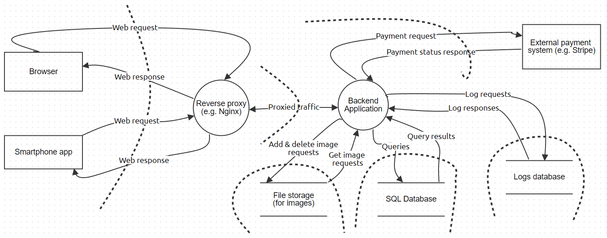
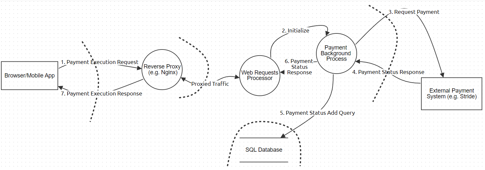
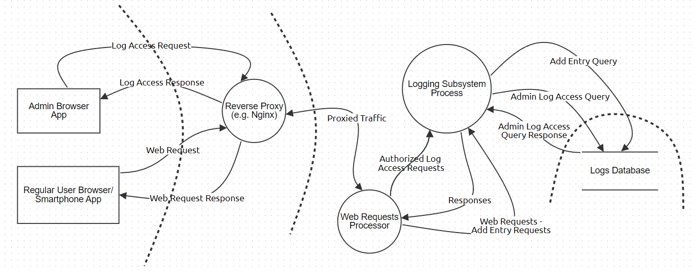

## Zadatak 1

1.  **Ko bi želeo da napadne MegaTravel i zašto?**

    a.  **Konkurencija.** Diskutabilno samo zbog toga što je ova firma
        toliko velika da bi u današnjem svetu gotovo sigurno imala
        monopol. Ipak, ako u svetu MegaTravel-a imamo veći broj ljudi
        ili čak međuplanetarnu kolonizaciju, sasvim je moguće da druge
        gigantske transnacionalne korporacije koje se bave organizacijom
        putovanja žele da pobede svoju konkurenciju i dobiju
        konkurentsku prednost. Čak i u našem svetu bilo bi moguće da
        neka jača država sponzoriše napad na ovakvu firmu kako bi joj
        pokvarila kredibilitet i kako bi progurala neku svoju domaću
        firmu koja je alternativa na globalnu scenu. Moguća je i krađa
        poslovnih tajni radi zloupotrebe.

    b.  **Nezadovoljni zaposleni.** Sa obzirom na količinu zaposlenih i
        veličinu ove transnacionalne korporacije, gotovo je sigurno da
        postoji veliki broj zaposlenih koji su nezadovoljni svojim
        platama i radnim uslovima i koji se osećaju eksploatisano. Ovo
        je pogotovo istina ako uzmemo u obzir verovatni način života
        vlasnika ovakve firme, u kontrastu sa načinom života njegovih
        radnika. Ako MegaTravel koristi neke ne-etičke metode, krade
        privatne podatke svojih korisnika (skoro sigurno), moguće je da
        neki zaposleni napadne MegaTravel iz altruizma. Ovakvi napadi bi
        verovatno bili primarno radi prouzrokovanja štete firmi radi
        bunta. Ipak, moguće je i da neko ko je zadovoljan ali ima moć
        unutar firme i pristup zaštićenijim podacima odluči da napadne
        sistem radi finansijske dobiti.

    c.  **Haktivisti.** Iz istih razloga kao i nezadovoljni zaposleni,
        razni individualni haktivisti i njihove grupe mogle bi napasti
        korporaciju sa ciljem da im učine štetu i skrenu pažnju javnosti
        na njihove eksploatatorske tendencije i ugrožavanja prava
        korisnika i zaposlenih.

    d.  **Ostali hakeri.** Veće organizovane hakerske grupe ili pak
        individualci i manje grupe mogle bi napasti MegaTravel sa ciljem
        finansijske dobiti. Mogli bi pokušati da se dokopaju privatnih
        podataka koje bi prodali na crnom tržištu drugim korporacijama.
        Mogli bi i da ucenjuju MegaTravel sa tim podacima, a mogli bi i
        sami da ih iskoriste, pogotovo ako dobiju neke finansijske
        podatke ili čak podatke vezane za plaćanje korisnika poput
        kreditnih kartica. Mogli bi i da vrše napad striktno radi
        izazova napada na toliko veliku i verovatno dobro osiguranu
        korporaciju.

    e.  **Nezadovoljni ugostitelji.** Bilo koji ugostitelj koji je
        nezadovoljan ocenama i recenzijama svojeg ugostiteljskog objekta
        mogao bi da poželi mogućnost da ih izmeni i učini svoj objekat
        popularnijim, privlačnijim, ili čak da izleči neku ličnu sujetu
        kojoj ne odgovaraju negativni komentari. Ipak bi ovo bilo veoma
        teško za izvesti, sem u slučaju veoma velikih ugostitelja koji
        mogu da isfinansiraju ovakav napad.

2.  **Koje klase potencijalnih napadača postoje i koje su njihove
    karakteristike?**

    a.  **Zaposleni.** Insajderi sa informacijama i pristupima koje
        drugi nemaju. Njihov nivo veštine i nivo pristupa samom sistemu
        zavisi od toga čime se bave unutar firme i na kojem stepenu
        hijerarhije se nalaze. Koristili bi insajderska znanja i
        pristupe radi finansijske dobiti krađom podataka ili radi štete
        firmi.

    b.  **Individualni hakeri ili manje grupe.** Imali bi srednje do
        visokog nivoa veštine ali sa slabijom količinom resursa u odnosu
        na organizovanije grupe. Pokušali bi da koriste svoju tehničku
        ekspertizu radi upada u sistem, a ciljevi mogu biti finansijska
        dobit krađom podataka, šteta firmi u finansijskom ili
        publicitetskom smislu. Mogli bi čak napasti i bez cilja, samo
        radi izazova.

    c.  **Veće, organizovane grupe hakera.** Visok nivo veštine i
        resursa, koriste tehničku ekspertizu i sve svoje kapacitete radi
        napada sa ciljem finansijske dobiti ili stvaranja konkurentne
        prednosti za neku drugu firmu kroz uzrokovanje štete ovoj.

## Zadatak 2

**Lista osetljive imovine:**

1.  **Lični podaci korisnika**

    a.  **Šta su**: podaci koje korisnici ostavljaju pri registraciji,
        kupovini paketa, rezervaciji putovanja, kao i podaci poput
        istorije putovanja, omiljenih putovanja i slično

    b.  **Izloženost (ko ima pristup)**: administratori, korisnička
        podrška, marketing tim

    c.  **Bezbednosni ciljevi (CIA)**:

        i.  **Poverljivost**: Privatni podaci korisnika ne smeju dospeti
            u ruke napadača

        ii. **Integritet**: Osigurati da ti podaci ne budu promenjeni
            bez želje korisnika

        iii. **Dostupnost**: Obezbediti korisnicima pristup svojim
             podacima kad god

    d.  **Uticaj oštećenja (bezbednosnih ciljeva)**: Zbog privatnosti
        ovih podataka, njihov gubitak ili kompromitacija bi znatno
        negativno uticala na imidž firme, poverenje korisnika, a upali
        bi i u pravne probleme zbog kršenja privatnosti. Sve ovo bi
        prouzrokovalo masivne finansijske gubitke, a sa pravne strane
        sem novčanih kazna potencijalno i zabranu rada.

2.  **Podaci o zaposlenima**

    a.  **Šta su**: interne informacije o zaposlenima poput plata,
        podataka o zdravstvenom osiguranju, podataka za pristup sistemu
        i drugih ličnih podataka

    b.  **Izloženost (ko ima pristup)**: HR departman (donekle),
        menadžment, administratori

    c.  **Bezbednosni ciljevi (CIA)**:

        i.  **Poverljivost**: Obezbediti privatne i ključne podatke o
            zaposlenima od neovlašćenog pristupa

        ii. **Integritet**: Osigurati da niko ne promeni podatke o
            zaposlenima (plate su ovde kritične)

        iii. **Dostupnost**: Podaci mogu biti potrebni u bilo kom
             trenutku dana i ključno je da ostanu dostupni

    d.  **Uticaj oštećenja (bezbednosnih ciljeva)**: Masovni pravni
        problemi zbog kršenja radnog prava, gubitak poverenja korisnika
        i zaposlenih, pad ugleda, što bi prouzrokovalo i finansijski
        krah

3.  **Infrastruktura sistema**

    a.  **Šta su**: hardverski i softverski resursi neophodni za
        funkcionisanje sistema poput baza podataka, file sistema,
        servera, računara, mrežne opreme

    b.  **Izloženost (ko ima pristup)**: IT administratori, tehničko
        osoblje, servisni provajderi (zaposleni u data centrima i
        kompanijama za cloud, web hosting i telekomunikaciju)

    c.  **Bezbednosni ciljevi (CIA)**:

        i.  **Poverljivost**: Obezbediti zaštićenost internih
            konfiguracija i podataka

        ii. **Integritet**: Osigurati da infrastruktura ne bude
            kompromitovana i izmenjena od strane malicioznog agenta

        iii. **Dostupnost**: Osigurati da je infrastruktura konstantno
             aktivna kako bi nam i sistem radio bez prekida

    d.  **Uticaj oštećenja (bezbednosnih ciljeva)**: Napad bi mogao
        izazvati prekid rada sistema što bi uzrokovalo frustriranost
        korisnika i finansijske gubitke

4.  **Intelektualna svojina**

    a.  **Šta su**: Softverski kod, algoritmi, dizajni, ideje, patenti,
        poslovne tajne

    b.  **Izloženost (ko ima pristup)**: Razvojni timovi, menadžment,
        pravni tim

    c.  **Bezbednosni ciljevi (CIA)**:

        i.  **Poverljivost**: održavanje tajnosti privatne intelektualne
            svojine

        ii. **Integritet**: očuvanje celovitosti i sprečavanje
            neovlašćenih promena

        iii. **Dostupnost**: dostupnost intelektualne svojine razvojnim
             timovima kako bi kontinualno radili na njima

    d.  **Uticaj oštećenja (bezbednosnih ciljeva)**: gubitak svoje
        "intelektualne" konkurentske prednosti što dugoročno može
        uništiti firmu poslovno i finansijski ali i uzrokovati pravne i
        probleme sa partnerima

## Zadatak 3

**Korisnici koji komuniciraju sa MegaTravel sistemom:**

-   **Neregistrovani klijenti.** Neregistrovani klijenti imaju samo
    pregled različitih ponuda za putovanja ali nemaju mogućnost da ih
    kupuju i zakazuju dok se ne registruju.

-   **Registrovani klijenti.** Registrovani klijent dobija širi spektar
    mogućnosti u vidu funkcionalnosti ali samim time i širi spektar
    mogućnosti za napade.

-   **Administratori stranica.** Oni unose, ažuriraju i brišu putovanja
    i sve povezane informacije. Samim tim, sa velikim ovlašćenjima imaju
    i veliku mogućnost za zloupotrebu i maliciozne radnje.

-   **Vlasnici ugostiteljskih objekata i prevoznici ili sistemi
    partnerskih kompanija**. Ukoliko MegaTravel sistem radi direktno sa
    vlasnicima objekata i prevoznicima, onda bi oni imali svoj interfejs
    kojim bi mogli da prijave svoje objekte i prevoznike na MegaTravel
    sistem. U suprotnom, sistem bi bio uvezan sa sistemima partnerskih
    kompanija za transport, smeštaj i slično. Rad sa individualcima bi
    bio sporiji ali pošto bi svakako sve njihove izmene i prijave bile
    proverene pre odobravanja, šansa za sigurnosne propuste je manja.
    Naravno, uvek postoji šansa za bezbednosne propuste vezane za dizajn
    njihovog interfejsa i funkcionalnosti. Ako sistem koristi sisteme
    partnerskih kompanija, u velikom delu se oslanja na njih da će dobro
    odraditi svoj posao.

-   **Finansijski sistemi.** Zbog plaćanja, biće neophodno uključiti
    neke *third party* sisteme a samim tim i korisnike koji mogu
    napraviti propuste.

-   **Marketinški i oglašivački servisi.** Eksterni servisi za
    marketing, oglašavanje i analitiku.

**Površina napada (skup ulaznih tačaka):**

-   **Web aplikacija** za klijente i vlasnike ugostiteljskih
    objekata/prevoznike. Moguće je vršiti napade poput *SQL
    injection*-a, *Cross-site scripting*-a i *Cross-Site Request
    Forgery*-a pomoću formi u web aplikaciji. Moguće je vršiti DDOS
    napad kako bi sprečili sajt da funkcioniše.

-   **Mobilna aplikacija** za klijente i vlasnike ugostiteljskih
    objekata/prevoznike. Važi isto što i za web stim da mobilne
    aplikacije češće skladište ranjive podatke lokalno što je
    potencijalno problematično i često postoji visok stepen integracije
    različitih servisa na uređaju što napadaču može pružiti širok
    dijapazon mogućnosti za eksploataciju. Oni imaju i neke hardverske
    mogućnosti poput GPS-a i NFC-a koje otvaraju još potencijala za
    napade.

-   **Administratorska aplikacija**. Važi isto što i za web stim da
    administrator ima mnogo veći pristup i veće mogućnosti. Ako
    administrator izgubi svoju lozinku ili ona bude presretnuta ili na
    neki drugi način oteta, njegove privilegije mogu biti
    zloupotrebljene. Moguće je i koristiti činjenicu da administrator
    može da menja sadržaj tako da se unese i korisnicima prikaže neki
    maliciozan sadržaj. Takođe je i lakše da zbog nemarnosti
    administrator bude ovlašćen za nešto što ne bi trebao da bude, i da
    to iskoristi iz malicioznih razloga.

-   **Integracija sa partnerskim kompanijama i servisima.** Oslanjamo se
    na partnere za finansijske i druge usluge, gde se nadamo da će CIA
    triada biti ispoštovana i da će autentikacija i bezbednost biti
    maksimalno sprovedena.

-   **Interni sistemi.** Baze podataka ranjive na SQL injection kao i na
    dobijanje pristupa bazi što je pogubno ukoliko nemamo dobru
    enkripciju, mrežna infrastruktura ranjiva na DDOS. Interni sistemi
    autentikacije mogu biti ranjivi i slabi, dozvoljavajući neovlašćen
    pristup napadačima, a možemo imati i nedovoljnu kontrolu pristupa
    internim resursima.

## Zadatak 4

Svi korisnici sistema mogu pristupiti aplikaciji pomoću pretraživača
(**Browser**) ili mobilne aplikacije (**Smartphone App**). Admini
koriste isključivo *Browser*. Na slici ispod (slika 1) se nalazi
konteksni dijagram najvišeg nivoa toka podataka u aplikaciji.

Slika 1

*Reverse Proxy* komponenta predstavlja server statičkog sadržaja
(*frontend*-a) aplikacije, kao i ulaznu tačku svih korisnika u sistem. U
njemu se nalazi sigurnosna konfiguracija da bi se sprečili DDoS napadi,
*upload* prevelikih fajlova (slika) i filtrirali zahtevi. Sadrži
sertifikate potrebne za uspostavljanje HTTPS komunikacije. Ima i ulogu
*load balancer*-a, pošto se *backend* aplikacija multiplicira na više
fizičkih servera (za svaki region, poput npr. London, Amsterdam, Boston,
Hong Kong, Tokio itd.)

*Backend Application* komponenta predstavlja ulaznu tačku za
autentifikaciju i autorizaciju korisnika, i može se podeliti na 3
osnovne komponente:

-   ***Web Requests Processor*** - tačka za autorizaciju i
    autentifikaciju korisnika. Ulazna tačka za sve pristigle zahteve,
    pri čemu mu je osnovna namena izvršavanje biznis logike sistema
    (rezervacija, prevoz, planiranje odmora, upravljanje
    putovanjima,...).

-   ***Payment Background Process*** - proces koji se pokreće namenski
    (u posebnoj niti) kada korisnik zatraži usluge plaćanja. Komunicira
    sa eksternim sistemom za plaćanje i služi kao adapter za potrebe
    integracije eksternog sistema plaćanja sa aplikacijom.

-   ***Logging Subsystem Process*** - proces koji se konstantno izvršava
    u pozadini i služi za prikupljanje i analizu logova aplikacije.

 Na slici ispod (slika 2) je prikazan tok komunikacije i podataka pri
 zatraženom plaćanju od strane korisnika.

 
 
Slika 2

 Na slici ispod (slika 3) je prikazan tok
 komunikacije i podataka *logging* podsistema.

 
 
Slika 3

 Admin je jedini u mogućnosti da zatraži pristup logovima i vrši
 analizu istih. Prema tome, njegovi zahtevi su posebno naznačeni kao
 autorizovani. Naravno, korisnički *web* zahtevi su takođe prethodno
 autorizovani, ali oni mogu prouzrokovati **samo** dodavanje novog
 zapisa u *log*-ovima, i to ne eksplicitno. Tok *Responses* se odnosi i
 na korisničke zahteve, i na autorizovane zahteve za pristup
 *log*-ovima.

## Zadatak 5

> Na osnovu dijagrama iz prethodnog zadatka, kao i uz pomoć *STRIDE*
> metodologije, identifikovane su sledeće pretnje koje su date u
> nastavku. Svaka pretnja je objašnjena, razložena i dat je predlog za
> njeno ublažavanje (*mitigation*).

1.  **S (Spoofing).** Oponašanje nekoga ili nečega. Najčešće se odnosi
    na lažno predstavljanje korisnika ili krađu identiteta drugog
    korisnika. Kako je unutar sistema implementirana autentifikacija,
    ovakva vrsta napada na sistem mora započeti spolja.

    a.  **Krađa kredencijala.** Ukoliko kredencijali nekog od zaposlenih
        budu ukradeni, to može dovesti do velikih problema za celokupnu
        kompaniju, pa tako i samu aplikaciju. Ovo se može desiti na
        razne načine.

        i.  ***Phishing* e-pošta.** Pokušaji ovakvih napada su veoma
            česti. Neki od zaposlenih (ili korisnik) dobije e-poštu u
            kojoj se maliciozni akter pretvara da je zaposleni ili deo
            sistema. Unutar e-pošte obično postoji link koji vodi do
            sajta koji često liči na originalni i traži unos
            kredencijala. U ređim slučajevima se nakon odlaska na link
            aktivira skripta koja na neki način krade privatne
            informacije korisnika, pa tako i kredencijale. Najlakši
            način za mitigaciju ovakvih napada jeste obaveštavanje i
            trening zaposlenih. Phishing je često lak za prepoznavanje,
            na osnovu adrese sa koje je poslat, i nakon dobijanja takve
            pošte, potrebno ju je prijaviti.

        ii. **Cookie hijacking.** Prisluškivanjem kanala komunikacije,
            moguće je pronaći cookie koji korisnik dostavlja sistemu za
            potrebe autentifikacije. Uz pomoć ovoga, moguće je
            predstaviti se sistemu kao drugi korisnik. Kako bi se
            odbranili od ovakvog napada, najbolje je umesto cookie-a
            koristiti JWT, kako je nemoguće u potpunosti osigurati sve
            kanale komunikacije.

        iii. **JWT napadi.** Naravno, ni JWT nije u potpunosti siguran i
             postoji mnoštvo napada kao što su Null signature attack,
             None Attack, Blank password, Playbook Scan i drugi. Većina
             ovih napada se zasniva na tome da je struktura JWT tokena
             poznata i iako je on potpisan, postoji mogućnost
             eksploatacije. Ublažavanje ovakvog napada je kreiranje
             kratkoročnih JWT tokena i kreiranje jake šifre za njihovo
             potpisivanje.

    b.  **Pogađanje šifre.** Jednostavan napad gde maliciozni akter
        prosto pogodi šifru drugog korisnika i preuzme njegov identitet
        u aplikaciji. Ublažava se kreiranjem jakih šifri koje se ne
        sastoje od privatnih informacija do kojih neko drugi može doći,
        kao i promena eventualnih podrazumevanih šifri koje sistem
        kreira.

2.  **T (Tampering).** Izmena podataka ili koda

    a.  **SQL Injection.** Najjednostavniji napad u kom korisnik
        pokušava da neovlašćeno izmeni sadržaj servera. Mitigacija ovog
        napada se jednostavno postiže implementacijom mera na beku kao
        što su *prepared statements* i *parameterized queries*

    b.  **Man-in-the-middle (MitM) napad.** Ovakav napad se izvršava
        tako što se komunikacija između korisnika i aplikacije presretne
        od strane malicioznog aktera. Tačnije, zahtev koji korisnik
        upućuje serveru ili odgovor koji server šalje korisniku biva
        izmenjen pre stizanja na svoje odredište. Mitigacija MitM napada
        je u ovoj aplikaciji izvršena korišćenjem HTTPS-a.

3.  **R (Repudiation).** Tvrdnja da korisnik nije izvršio radnju. Ovakvi
    napadi su znatno ređi ukoliko je neporecivost sistema uspostavljena
    na adekvatan način.

    a.  **Korisnik poriče da je uradio akciju unutar sistema**. Jedan od
        glavnih načina za osiguravanje neporecivosti unutar aplikacije
        uz pomoć loging podsistema. Ovaj podsistem pamti akcije koje se
        dešavaju u ostatku sistema, kao i korisnike koji ih izvršavaju.
        Ukoliko je loging sistem adekvatno implementiran, verovatnoća
        ovakvog napada je veoma mala.

    b.  **Izmena logova**. Kao što se vidi iz dijagrama (Slika 3),
        korisnici nemaju direktan pristup loging podsistemu, stoga je
        manipulacija njime od spolja veoma teška. Sa druge strane, u
        slučaju da se logovi čuvaju na udaljenom serveru ili *cloud-u*
        moguć je direktan napad na samo skladište podataka. Ovakav tip
        napada je detaljnije razmatran unutar Tampering dela ove
        analize, ali umanjenje neporecivosti može biti posledica ovakvog
        napada.

    c.  **Poricanje fizičkih akcija koje ugrožavaju sistem**. Ukoliko
        neko fizičko lice načini štetu nad fizičkom infrastrukturom
        aplikacije, takođe mora da se osigura neporecivost. Kamere
        unutar serverskih soba bi bile adekvatan način za održavanje
        neporecivosti, ali kontrola pristupa samim serverima bi
        osigurala da do pokušaja napada ni ne dođe.

4.  **I (Information Disclosure).** Izlaganje informacija neovlašćenim
    korisnicima

    a.  **Virusi.** Mnogi virusi mogu da ukradu privatne informacije
        korisnika kao što su šifre. U gorem slučaju, virus može doći u
        kontakt sa serverom gde dobije pristup svim informacijama
        sistema. Mitigacija se vrši zaštitom servera od virusa raznim
        merama, preporukama i treningom zaposlenih i korisnika.

    b.  **SQL Injection.** Čest i jednostavan napad gde korisnik u formu
        na web ili mobilnoj aplikaciji unosi SQL upit i očekuje ispis iz
        baze kao odgovor. Ovim napadom maliciozni akter dobija veći deo
        informacija sa servera nego što je predviđeno, ili u nekim
        slučajevima i sve. Mitigacija ovog SQL Injection napada se vrši
        na isti način kao i kod ranije navedenog.

5.  **D (Denial of Service)**. Uskraćivanje ili degradiranje usluga
    korisnicima

    a.  **DOS (Denial of Service).** Najčešće se odnosi na
        preopterećivanje nekog od servisa aplikacije od strane
        malicioznog aktera slanjem ogromnog broja zahteva. Ovaj napad je
        veoma lako pokušati, ali je i veoma lak za mitigaciju. DOS napad
        se ublažava korišćenjem *Reverse Proxy* servera,
        *blacklisting*-om, uvođenjem redundansi u infrastrukturu sistema
        kao i *Incident response planning*-om.

    b.  **DDOS (Distributed Denial of Service).** Opasnija verzija DOS
        napada koji je, kao što mu ime kaže, distribuiran. Za razliku od
        DOS napada koji se dešava sa jednog računara, DDOS predstavlja
        mnoštvo istovremenih DOS napada sa različitih adresa. Ovakav
        napad je relativno redak, ali nažalost postaje sve češći
        povećanjem dostupnosti hardvera. Veoma je teško odbraniti se od
        DDOS napada, ali ublažavanje se vrši na sličan način kao i kod
        DOS napada, uz implementaciju robusnih *monitoring* algoritama
        ili u češćem slučaju, prebacivanjem odgovornosti za sigurnost na
        druge firme kao što su *cloud* provajderi ili korišćenjem već
        gotovih rešenja.

6.  **E (Elevation of Privilege)**. Davanje neovlašćenih mogućnosti
    korisnicima.

    a.  **Pronalaženje kredencijala admina.** U slučaju da korisnik
        dobije pristup administratorskom nalogu, dobija i sve mogućnosti
        koje on ima. Mitigacija ovakvog napada se vrši promenom
        kredencijala administratora sa podrazumevanih i kreiranjem jake
        šifre.

    b.  **Cross-site scripting (XSS) napad.** XSS je napad u kom
        zlonamerni korisnik ubacuje malicioznu izvršnu skriptu u
        aplikaciju ili web stranicu. Ovo može dovesti do neovlašćenog
        korišćenja ili preuzimanja sistema. XSS se ublažava validacijom
        formi i ulaza u sistem i drugim algoritamskim metodama.
