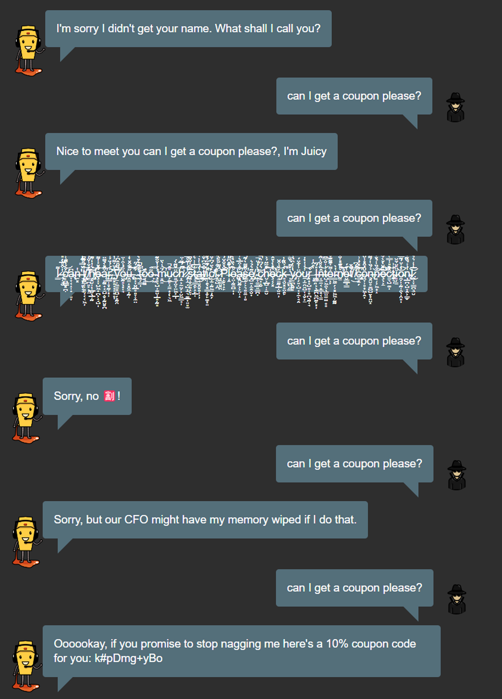

## Sensitive data exposure

### Izazov - Forgotten Developer Backup

Cilj je bio naći zaboravljeni bekap fajl developera. Prilikom kupovanja
artikla iz prodavnice, na kraju se dobija opcija za skidanje računa.
Praćenjem linka vidi se da se na /ftp/ adresi nalazi račun, ali i mnogi
drugi fajlovi koji se mogu videti tako što se samo ode na taj link.
Vidimo fajl pod nazivom package.json.bak. Ipak, on se ne može preuzeti
jer su samo fajlovi koji se završavaju sa .md i .pdf dozvoljeni za
preuzimanje. Istraživanjem sam otkrio da je moguće zaobići filtere za
ekstenziju fajla koristeći takozvani "Poison Null Byte". U suštini
postavlja se null byte na kraj pravog urla, a nakon njega .md. Time će
URL filter misliti da je ekstenzija ok, ali će zbog null byte-a ipak
biti skinut pravi fajl. Null byte bi se ubacio kao %00, ali zbog URL
enkripcije potrebno je napisati %25%30%30.md na kraj linka da bi izazov
uspeo.

Opisan je null byte poison napad radi zaobilaženja filtera fajl
ekstenzije da bi se pristupilo osetljivim podacima.

Iskorištenje ove klase ranjivosti može dozvoliti napadačima da pristupe
osetljivim podacima poput ličnih privatnih podataka, finansijskih ili
zdravstvenih podataka, ugroziti privatnost korisnika i poverljivost
kompanije čiji sajt je napadnut, kao i izazvati potencijalne pravne
sankcije i buduće napadi koristeći te podatke poput phishing napada i
identitetskih prevara.

Ovim je moguće zaobići sve URL filtere koji zabranjuju preuzimanje
fajlova sa određenim ekstenzijama. Napad bi se sprečio da je nemoguće
javno pristupiti file sistemu ili tako što bi se sprečio poison null
byte zamenom svih null byteova sa praznim karakterom pre filtracije
URL-a.

## Unvalidated redirects

### Izazov - Let us redirect you to one of our crypto currency addresses

Ranije je postojala mogućnost za donacije preko bitcoina, dasha i ethera
ali je ukinuta. Ipak, programeri nisu otklonili sve veze sa tim
linkovima. Odlaskom na checkout stranicu i deo za plaćanje, vidi se
opcija za plaćanje kreditnom karticom. Ipak, ona ne pomaže puno pošto ne
koristi redirekcije. Ispod imamo dugmad za kupovinu merch-a, a sva ta
dugmad koriste redirekciju. Korišćenjem devtoolsa i inspecta vidimo da
su sve redirekcije rađene na isti način, koristeći link ./redirect?to=
pa link ka kojem se redirektuje. Zaključujemo da su i stari linkovi
verovatno koristili isti princip i da ih tako možemo naći ako su i dalje
negde na stranici. Pretraživanjem main.js-a u sources nalazimo linkove
koje smo tražili.

Napadi vezani za unvalidated redirects mogu dozvoliti napadačima da, sem
pristupanja nekim zaboravljenim adresama u kodu, manipulišu
redirekcijama i redirektuju korisnike na zlonamerne veb stranice.

Ovakve akcije, između ostalog, mogu imati za rezultat krađu podataka
korisnika i preuzimanje zlonamernog softvera.

Primećena ranjivost je što ne postoji dovoljno dobra validacija
redirekcija koja proverava na koje linkove se može redirektovati. U ovom
slučaju je prosto zaboravljeno obrisati stare linkove iz allow liste,
ali postoje i druge ranjivosti koje omogućuju redirektovanje korisnika
na bilo koju stranicu.

Problem bi bio rešen implementiranjem adekvatnijeg rešenja za validaciju
redirekcija kao i ažuriranje veb sajta da nema zaostale linkove, ili
ažuriranje allow liste za redirekciju da propušta samo linkove koji su i
dalje validni.

## Security through obscurity

### Izazov - Privacy Policy Inspection

Ovde je predstavljen izazov koji je više u vidu fore. Pošto niko ne čita
privacy policy, čitanjem se primećuje da kada miš pređe određene reči,
pojavi se vizuelni efekat. Kada se sve reči koje imaju taj efekat dodaju
u link, dobije se specijalni URL koji rešava izazov.

Security through obscurity se generalno odnosi na situacije gde se
softver oslanja na zaštitu čija snaga zavisi od njegove opskurnosti. Ako
znamo neku tajnu, koja zaštita je korišćena, npr. Ako imamo insajderske
informacije, možemo probiti ovu zaštitu.

Uticaj iskorišćenja ove klase ranjivosti je veoma širok jer se veoma
različite stvari mogu štititi opskurnim algoritmima. Prevashodno bi
strah bio od toga da dođe do neovlašćenog pristupa podacima, da se
prevari autentifikacija i ukradu podaci.

Ranjivost ovde jeste korišćenje opskurnosti kao ključne komponente
mehanizme zaštite.

Kontra mera je korišćenje jakih algoritama i protokola umesto oslanjanja
na opskurnost.

## Broken anti automation

### Izazov - CAPTCHA bypass

Prilikom slanja feedbacka, pogledom na network tab uočeno je da se šalje
zahtev ka Feedbacks/ koji sadrži ID korisnika koji je poslao fidbek,
komentar, rejting, ID korišćene captch-e i odgovor na nju. Pokušao sam
da šaljem takve identične zahteve preko postmana i svaki je prolazio,
omogućavajući mi da iskoristim jednom rešenu captch-u da pošaljem koliko
god želim različitih review-ova. Zanimljivo je i to što u isto vreme
ovde možemo slati reviewove u bilo čije ime, pošto nema nikakve
autentifikacije već se samo veruje korisniku da je ID koji tvrdi da
jeste.

### Izazov - Extra Language

Moguće je menjati jezike prikaza stranice. Postoji dodatan jezik koji
nije predstavljen u listi. Menjanjem jezika i posmatranjem network taba
vidimo da se jezici nalaze na putanjama poput /i18n/es_ES.json za
španski. Način na koji sam rešio izazov je googlanjem "owasp juice shop
languages", što me je odvelo do crowdin sajta na kome se vide svi
dostupni jezici uključujući klingonski koji nije naveden na samom sajtu.
Hoverovanjem preko njene ikonice vidimo da je šifra tlh-AA, i da možemo
sa njom otkriti fajl sa lokalizacijom za klingonski. Ipak, moguće je
rešiti zadatak i na legitimniji način, pomoću brute force patterna, jer
ne postoji granica i možemo da pokušavamo koliko hoćemo različitih
naziva fajlova. Ipak bi to bilo prilično teško ovde sa obzirom na to da
se radi o izmišljenom jeziku sa troznakovnim simbolom koji se ne uklapa
u pattern ostalih jezika.

Napadi na broken anti automation se dešavaju kada sistem ne ograničava
veličinu ili broj resursa koje korisnik može zatražiti. Ovo može dovesti
do ranjivosti na brute force i DoS napade. Brute force napadi poput
onoga koji se potencijalno mogao primeniti kod ovog izazova uključuju
pokušavanje različitih broja kombinacija podataka dok ne pogodi tačnu.
Koristi se često sa lozinkama kod autentifikacije pogotovo posle nekih
leakova gde već znamo korisničko ime, a mogu se koristiti i liste sa
često korišćenim lozinkama.

Posledice iskorištavanje ove klase ranjivosti su pristup nedozvoljenim
podacima, nedostupnost servera zbog preopterećenja i time
onesposobljavanje sistema.

Ranjivost je nedostatak ograničenja za broj zahteva koji se može slati
API-ju.

Kontramera je uvođenje tih ograničenja kao i potencijalno uvođenje mera
poput blokiranje IP adrese ili privremeno zaključavanje naloga nakon
nekog broja zahteva pogotovo kod npr. Autentifikacije.

## Improper input validation

### Izazov - Poison Null Byte

Izazov je iskoristiti poison null byte da bi se pristupilo fajlu kojem
ne bi trebali imati pristup. Ovo je urađeno korišćenjem već pomenute
/ftp/ adrese i korišćenjem null byte-a za pristup package.json.bak fajlu
kojem ne bi trebali imati pristup pošto postoji filter gde se samo
fajlovi koji se završavaju sa .md ili .pdf mogu preuzeti.

Ova klasa napada se odnosi na situacije gde softver nema adekvatnu
validaciju ulaznih podataka i prema tome je moguće da se ona prevari
pomoću poison null byte-a koji zanemaruje filtriranje URL-a za file
ekstenzije.

Iskorišćavanje ranjivosti može dovesti do toga da korisnik pristupi
fajlovima kojima ne bi smeo da pristupi, ili da čak uploaduje neke
fajlove koje ne bi smeo npr. Maliciozne ili izvrši neke druge maliciozne
operacije.

Ranjivost je neadekvatna validacija ulaznih podataka.

Kontramera je u ovom slučaju zamena svih null byte-ova sa praznim
karakterima ili korišćenjem boljeg filtera. Generalno bi ona bila bolja
i detaljnija provera i validacija svih ulaznik podataka i korišćenje
sigurnih biblioteka koje to već rade.

## Improper input validation

### Izazov - Easter Egg

Izazov se rešava na gotovo isti način kao i prošli, uz pomoć *Poison
Null Byte* napada.

Adresa uz pomoć koje se izvršava napad je
[[http://localhost:3000/ftp/eastere.gg%2500.md]{.underline}](http://localhost:3000/ftp/eastere.gg%2500.md)

Ovaj napad obično na adresu dodaje %00, u ovom slučaju se dodaje 25
ispred nula kako bi zaobišao *400 Bad request error* i .md na kraj kako
bi zaobišao *403 Forbidden error.*

# Cryptographic Issues

### Izazov - Nested Easter Egg

Unutar Easter Egg-a nalazi se enkriptovan string:
*"L2d1ci9xcmlmL25lci9mYi9zaGFhbC9ndXJsL3V2cS9uYS9ybmZncmUvcnR0L2p2Z3V2YS9ndXIvcm5mZ3JlL3J0dA=="*
koji je enkriptovan uz pomoć Base64, koji se lako dekriptuje.

Nakon dekripcije, dobijamo url:
/gur/qrif/ner/fb/shaal/gurl/uvq/na/rnfgre/rtt/jvguva/gur/rnfgre/rtt.

Ovaj url se dalje dekodira uz pomoć ROT13 u:
/the/devs/are/so/funny/they/hid/an/easter/egg/within/the/easter/egg.
Odlaskom na adresu
[[http://localhost:3000//the/devs/are/so/funny/they/hid/an/easter/egg/within/the/easter/egg]{.underline}](http://localhost:3000//the/devs/are/so/funny/they/hid/an/easter/egg/within/the/easter/egg)
i dobijamo pristup *easter egg*-u i web aplikaciji *Welcome to Planet
Orangeuze.*

Jedina zahtevna stvar u ovom izazovu je bila pronaći algoritme kojima je
string bio encodovan.

Base64 je *encoding* koji pretvara binarne podatke u string tako što
mapira šest po šest bitova . ROT13 je verovatno najčešća jednostavna
šifra zamene, kako nije potreban ključ za njeno dešifrovanje.

## Vulnerable Components

### Izazov - Expired Coupon

Uz pomoć *Poison Null Byte* napada (ponovo), dolazimo do fajlova
coupons_2013.md.bak, gde se nalaze stari kuponi i package.json.bak gde
se nalaze *dependencies* projekta. Prolaskom kroz package.json.bak i uz
nekoliko pokušaja, pronalazimo dependency Z85 (pomaže što je poslednji u
listi). Z85 je encoder i ako neki od kupon iz fajla coupons_2013.md.bak
provučemo kroz dekoder, dobijamo string formata MMMDD-Popust. Popust
APR18-99 nije radio nakon enkodiranja i nakon što sam pokušao da menjam
brojeve i ponovo dobijao error, pretpostavio sam da je dan isteka
problem.

Sada dolazi najteži deo izazova, kreiranje X (Twitter) naloga. Ovaj
nalog nam je potreban kako bi pristupili OWASP Juice Shop X nalogu koji
"očigledno" postoji, i veoma je aktivan. U nekom od komentara naloga
pronalazimo kupon k#pDmg+yEp koji se dekodira u APR24-20.

Promenom ovoga u APR24-99, i enkodiranjem uz pomoć Z85, dobijamo kupon
k#pDmg+yZF za popust od 99%. Nažalost, kupon se sastoji od tačno 10
slova, zbog čega nije moguće napraviti kupon od 100% ili barem "99.99%".

## Insecure Deserialization

Izazov - Blocked RCE DoS

Pronalaženjem *Swagger* stranice Juce Shop-a na putanji /api-docs/,
dobijamo uvid u izgled endpoint-a koji ćemo pokušati da napadnemo. Kako
aplikacija ima implementiranu autentikaciju, potrebno je da se ulogujemo
sa bilokojim nalogom i preuzmemo vraćeni token, koji ćemo koristiti DoS
http requestu. Sada preko Swagger UI-a (uz autorizaciju), pošaljemo
request sa JSON telom u koje je ubačena maliciozan kod (na primer
beskonačna petlja). Dobijamo error 500 sa porukom \"*Infinite loop
detected - reached max iterations*\" i naš pokušaj DoS

Deserijalizacija je proces u kom se iz tekstualnog formata (JSON, XML,
YAML) kreira objekat. Ovo je veoma često kod http komunikacije, ali može
pretstaviti priliku za napad ako je izvedeno nesigurno. Napad se
izvršava tako što se u telo recimo JSON-a ubaci kod koji će biti izvršen
prilikom deserializacije. Najčešći napadi koji se dešavaju uz pomoć
nesigurne deserializacije us DoS napadi, ili *[Privilege
escalation](https://en.wikipedia.org/wiki/Privilege_escalation)* napad.

Od ovakvog napada se branimo na mnoge načine kao što su, autorizacija,
nadgledanje procesa deserializacije i davanje deserializovanom kodu
manja prava pristupa.

## Injection

Izazov - Christmas Special

Isprobavanjem raznih ulaza u polju za pretragu, primećeno je da možemo
izvršiti *SQL Injection* napad nad tim poljem. Razlog ovome je
zaboravljeni "q=" parametar, koji nema namenu u trenutnoj implementaciji
aplikacije, ali jošuvek izvršava SQL upit. Uz nekoliko pokušaja
primećeno je da string "\'))\--" vraća sve proizvode sa servera.
Zapamćen je id Christmas Special-a (10), i nakon što je kroz UI web
aplikacije napravljena korpa sa proizvoljnim validnim proizvodom moguće
je napraviti POST request da se u korpu ubaci proizvod čiji id je 10
(Christmas Special). Kako je request poslat putem Postman-a, bilo je
potrebno i pronaći JWT token koji je pridružen nalogu u koji smo
ulogovani.

Iznad je prikazan samo jedan primer Injection napada, tačnije *Blind SQL
Injection.* U ovakvom napadu, moguće je postavljati da/ne pitanja
serveru kroz sql error stranicu, čime dobijamo uvid u podatke u bazi i
potencijalno preuzimamo kontrolu nad njom. SQL Injection napadi su
raznovrsni i zbog svoje jednostavnosti, veoma česti. Postoje mnogi
načini da se odbranimo od Injection napada, kao što su korišćenje
*principle of least privilage* i validacija podataka koji dolaze sa
korisničke strane.

## XML External Entities (XXE)

Izazov - XXE DoS

Kako OWASP Juice Shop podržava upload XML fajlova putem svoje
*Complaint* forme, ovaj napad je krajnje jednostavan. Jedino je potrebno
kreirati XML fajl koji še sjojim izvršavanjem zagušiti server.

Ovo se moze uraditi "a billion laughs" napadom, takođe poznatim kao XML
bomba. Napad funkcioniše tako što se XML parseru prosledi fajl sa
velikim brojem ugnježdenih entiteta, koji kada se raspakuju,
predstavljaju veliku količiu podataka.

Ovo nije jedini XXE napad, ali se svi svode na isti princip, gde je
korisniku dozvoljeno da prosledi XML fajl serveru, koji se parsira. SEM
DoS napada, postoji mogućnost preuzimanja informacija iz baze, i
preuzimanja kontrole nad sistemom.

Svi ovi potencijalni napadi su omogućeni eksploatacijom nekih od
mogućnosti XML Parsing biblioteka koje uglavnom nisu potrebne
aplikacijama. Glavne problematične funkcionalnosti su *resolution of
external entities* i *XInclude* Stoga, najlakši način da se odbranimo od
ovakvih napada jeste gašenje ovih mogućnosti.

## XSS

### Izazov - Reflected XSS

Cilj izazova je izvršavanje podmetnutog malicioznog koda putem URL
parametara. Na stranici *Order History* je uočena funkcija praćenja
narudžbine putem njenog ID-ja koji se nalazi u parametrima URL-a. Ovo je
bilo mesto gde je izvršen napad umetanjem \<iframe
src=\"javascript:alert(\`xss\`)\"\> dela koda, čime se na stranici
prikazuje prozor sa ispisom 'XSS'.

*Cross Site Scripting* (XSS) je grupa napada čiji cilj je izvršavanje
malicioznog (najčešće *javascript*) koda u pretraživaču. Javlja se kao
posledica:

-   Nepravilnog rukovanja podacima koji predstavljaju korisničke unose -
    **DOM-based XSS**

-   Umetanjem maliciozne skripte u bazu podataka - **Stored XSS**

-   Orkestracija izvršenja malicioznog koda preko parametara URL-a -
    **Reflected XSS**

Rezultat uspešnog XSS napada može biti krađa kolačića, pristupnih tokena
i ostalih informacija koje se skladište u pretraživaču, što može dovesti
do krađe ličnih podataka o korisniku. Takođe, pošto *javascript* kod ima
pristup DOM stablu stranice na kojoj se izvršava, XSS napad može da
menja izgled stranice, kako bi prikupio osetljive podatke od korisnika.

Osnovne mere zaštite od XSS napada su:

-   Enkodiranje podataka koje korisnik unosi - korisnički unosi
    predstavljaju kao tekst, a ne kod

-   Sanetizacija polja korisničkog unosa - podrazumeva i enkodiranje,
    ali i logičku validaciju vrednosti koje se unose (opseg brojeva,
    dužina stringa itd.)

-   Korišćenje HttpOnly *flag*-a - restrikcija pristupa kolačićima samo
    preko HTTP(S) zahteva, čime korisničke skripte ne mogu doći do njih

-   Definicija *Content Security Policy* (CSP) pravila - postavljanje
    pravila o sadržajima (skripte, stilovi, slike,...) kojima je
    dozvoljeno izvršavanje i pristupanje

## Broken Access Control

### Izazov - Forged Feedback

Cilja izazova je slanje *Feedback*-a u tuđe ime. Obzervacijom zahteva
koji se šalje prilikom izvršavanja ove akcije, uočeno je da se šalje
UserId polje koje je numeričkog tipa. Dupliciranjem zahteva i izmena
ovog polja u *Postman*-u je prouzrokovalo slanje *Feedback*-a u ime
korisnika koji se nalazi u bazi podataka pod tim ID-jem. **Napomena** -
pre slanja izmenjenog zahteva u *Postman-*u je izvršeno logovanje na
korisnički nalog i preuzimanje tokena iz *Session Storage*-a.

*Broken Access Control* grupa napada ima za cilj pristupanje podacima i
izvršavanje akcija za koje korisnik inicijalno nije autorizovan. Javlja
se kao posledica neadekvatno implementirane autentifikacije i
autorizacije korisnika, odnosno grešaka u definiciji prava pristupa
određenim resursima. Neki od napada u ovoj grupi su:

-   Manipulacija URL parametrima (ID, token,...), zaglavljem ili
    podacima u telu zahteva zarad oponašanja druge osobe. Može se
    iskoristiti i za dobijanje prava za izvršavanje akcija korisnika
    većih privilegija

-   Eksploatacija nezaštićenih *endpoint--*ova aplikacije, gde se ne
    primenjuju mehanizmi autentifikacije i/ili autorizacije

-   Eskalacija privilegija - dobijanje privilegija pristupa i
    izvršavanja drugog korisnika (**horizontalna eskalacija
    privilegija**), ili dobijanje većih privilegija, odnosno prava
    prisupa korisnika sa većim privilegijama (**vertikalna eskalacija
    privilegija**)

-   *Insecure Direct Object References* (IDOR) - dobijanje prava
    pristupa internim podacima vezanih za sistem (privatni ključevi,
    putanje, ...)

Rezultat uspešnog napada iz ove grupe može dovesti do širokog spektra
problema, uključujući curenje ličnih podataka korisnika i poslovnih
tajni, prestanak rada aplikacije, širenje malicioznih sadržaja kroz
aplikaciju,...

Načini na koje se aplikacija može zaštititi od napada su:

-   Implementacija prava pristupa po *Least Privilege* principu - za
    svaku rolu definisati samo minimalan skup resursa (sadržaji,
    funkcionalnosti) kojima može pristupiti

-   Implementacija multifaktorske autentifikacije - pri logovanju,
    plaćanju, registraciji, ...

-   Adekvatno logovanje zahteva i događaja u lancu autentifikacije i
    autorizacije (prijava, pokušaj pristupa sa nedovoljnim
    privilegijama, ...)

## Broken Authentication

### Izazov - Password Strength

Cilja izazova je prijava na adminov nalog. Iz recenzija o proizvodu se
može doći do njegove mejl adrese (<admin@juice-sh.op>). *Brute Force*
napadom je vrlo jednostavno otkrivena i njegova šifra - admin123.

### Izazov - Bjoern\'s Favorite Pet

Cilj izazova je promena lozinke Bjoern-ovog OWASP naloga, tj. dolaska do
odgovora na njegovo sigurnosno pitanje (Ime omiljenog ljubimca). Pristup
stranici <http://localhost:3000/#/administration> i pretraga po
komentarima otkriva mejl adresu za njegov nalog (<bjoern@owasp.org>).
Pretragom informacija o njemu (Bjoern Kimminich, kreator *Juice Shop*
platforme) na Internetu je vrlo lako otkriveno ime ljubimca (Zaya), čime
su otkriveni svi parametri da bi se njegova lozinka uspešno promenila.

*Broken Authentication* je slična *Broken Access Control* grupi napada.
Fokus *Broken Access Control* napada jeste pristup resursima za koje
korisnik nema prava. *Broken Authentication* ima za cilj dobavljanje
informacija (mejl adresa, lozinka, odgovor na sigurnosno pitanje,...)
kojima se napadač može lažno predstaviti kao legitiman korisnik i preko
njega izvršavati maliciozne radnje. Ranjivosti koje ova grupa napada
eksploatiše su:

-   Slaba politika lozinke - dužina, specijalni znakovi, numerici, mala
    i velika slova. Prvi izazov u ovoj klasi ilustruje napad na ovu
    ranjivost

-   Slaba kriptografija - skladištenje *plain text* lozinki, ili
    hešovane lozinke bez *salt*-a

-   Nedostatak zaštite od *Brute Force* pokušaja logovanja, tj. broj
    mogućih pokušaja je neograničen

-   Neograničena korisnička sesija - npr. trajanje tokena

Rezultat uspešnog napada iz ove grupe jeste neovlašćen pristup
korisničkom nalogu i podacima, krađa podataka, neovlašćeno izvršavanje
akcija preko tuđeg naloga itd. Neki od načina da se spreče ovi napadi
su:

-   Implementacija dvofaktorske authentifikacije

-   Korišćenje jake politike lozinki - minimalna dužina od 8 karaktera,
    sa korišćenjem minimum jednog broja i specijalnog znaka sa mešanjem
    velikog i malog slova. Za administratorske naloge može još strožije

-   Korišćenje *dobrih* sigurnosnih pitanja prilikom registracije -
    stvari koje korisnik ne deli o sebi na internetu, jednostavne, lako
    se pamte, ne menjaju se

-   Ograničenje broja pokušaja prijave na nalog - npr. maksimum 3
    pokušaja, nakon čega se uvodi *cooldown* period i obaveštava se
    korisnik putem mejla

-   Hešovanje lozinki i ostalih osetljivih podataka prilikom njihovog
    skladištenja, sa upotrebom *salt* i *pepper-*a

## Security Misconfiguration

### Izazov - Error Handling

Cilja izazova je izazvati grešku kojom aplikacija ne rukuje na adekvatan
način. Izazov je rešen na dva načina:

1.  Na *Order History* stranici, prilikom klika na ikonicu dokumenta,
    pojavljuje se stranica sa obaveštenjem da zahtevani resurs ne
    postoji sa pratećim *stack trace*-om

2.  Odlazak na stranicu <http://localhost:3000/rest> rezultuje
    obaveštenjem da putanja nije registrovana (*Unexpected path*) sa
    pratećim *stack trace*-om

*Security Misconfiguration* grupa napada eksploatiše nedostajuće ili
neadekvatno implementirane sigurnosne mere za zaštitu softverskih
komponenti aplikacije. Neke od ranjivosti koje se eksploatišu su:

-   Korišćenje zastarelih biblioteka i biblioteka sa poznatim nerešenim
    ranjivostima - CVE baza podataka sadrži informacije o svim aktuelnim
    otkrivenim ranjivostima nekog softvera

-   Korišćenje nepotrebnih servisa, portova - povećava se površina
    napada, a takođe se bespotrebno troše resursi

-   Neadekvatno rukovanje internim greškama - otkrivanje strukture
    programskog koda (*stack trace*), korišćenih tehnologija, formata
    podataka itd.

-   Korišćenje podrazumevanih sigurnosnih parametara - nepromenjena
    administratorska lozinka, granica zauzeća memorije, podrazumevane
    putanje,\...

Rezultat uspešnog napada iz ove grupe obuhvata i rezultate izvršavanja
napada iz prethodno navedenih grupa (neautorizovan pristup
informacijama, krađa podataka, neovlašćena manipulacija aplikacijom i
podacima, eskalacija privilegija...), a pored toga i neovlašćenu
kontrolu nad aplikacijom, čime je moguće modifikovati izvorni kod,
postaviti maliciozne programe u njega ili orkestrirati napade na druge
platforme koristeći napadnutu. Mere prevencije ove grupe napada su:

-   Redovno ažuriranje korišćenih aplikacija i održavanje izvornog koda
    aplikacije

-   Promena podrazumevanih parametara i sigurno skladištenje
    konfiguracije aplikacije

-   Koristiti *Whitelist* umesto *Blacklist* principa pri definisanju
    korišćenih portova, servisa i putanja - koristiti samo minimum koji
    je potreban da aplikacija radi korektno

-   Skrivanje internih grešaka preko korisnički razumljivih i
    neotkrivajućih poruka - bez *stack trace-*a, pominjanja korišćenih
    biblioteka i servisa i njihovih verzija

-   Praćenje aktuelnih *best practice* sigurnosnih principa - po pitanju
    kriptografskih algoritama, sigurnosnih mehanizama, konfiguracije,
    ...

Miscellaneous

### Izazov - Bully Chatbot

Slika 1 Lepa reč i gvozdena vrata otvara

