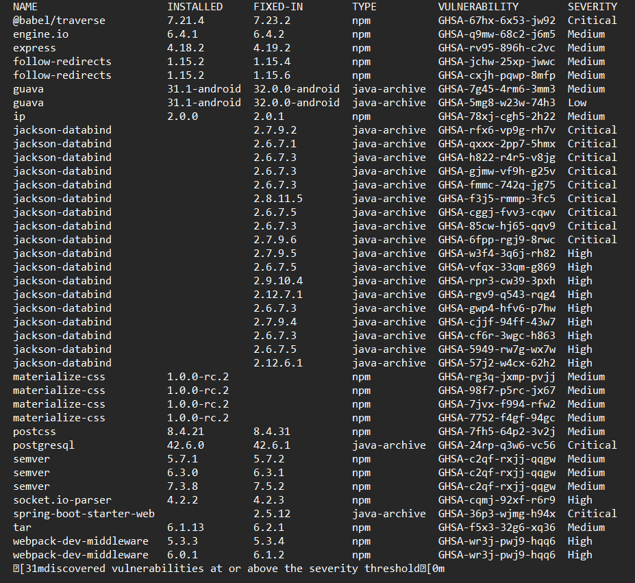

# **Aplikacija za potpisivanje elektronskih sertifikata**

Tech Stack

Backend:

- Java
- Spring Boot

Frontend:

- Angular (koristeći material)

# **Opis**

Fokus ovog projekta je bio kreiranje softvera za potpisivanje digitalnih sertifikata sa akcentom na bezbednosti. Sa ovim u vidu, nije bio očekivan ogroman broj propusta u bezbednosti. Ovo je bila pogrešna pretpostavka. Najverovatniji razlog propustima je to što se razvojni tim prvi put sretao sa ovakvim problemima i na nevešt način se izborio sa njima.

Aplikacija je namenjena za tri vrste korisnika:

1. **Neregistrovani korisnici** - Imaju veoma ograničen skup funkcionalnosti, većinom je fokus bio na registrovanim korisnicima.
2. **Registrovani korisnici** \- Ovi korisnici mogu da pregledaju svoje sertifikate. Mogu da vide javne sertifikate drugih korisnika, i root sertifikate. Mogu da podnose zahteve za kreiranje end sertifikata. Mogu da dobiju pristup svojim sertifikatima i da ih sačuvaju lokalno.
3. **Administratori** \- Poseduju root sertifikate. Imaju uvid u registrovane korisnike i njihove sertifikate. Imaju pregled zahteva za kreiranje sertifikata. Imaju mogućnost da prihvate ili odbiju kreiranje sertifikata.

Članovi razvojnog tima

- Maja Varga SV54/2020
- Marko Milijanović SV56/2020
- Vuk Radmilović SV73/2020

# **Defekti**

- **Slanje lozinki preko HTTP**:
  - Lozinke se šalju preko nebezbedne HTTP veze, što ih čini podložnim krađi tokom procesa prijave korisnika.
    - **Preporuka**: Implementirati sigurnu HTTPS vezu za sve komunikacije koje uključuju slanje osetljivih podataka, kao što su lozinke korisnika.
- **Resetovanje lozinke bez provere broja pokušaja**:
  - Sistem omogućava resetovanje lozinke bilo kom korisniku ako se unese validan ID korisnika i kod za reset. Nedostaje provera koliko puta je korisnik pokušao da unese kod za reset.
    - **Preporuka**: Implementirati proveru broja pokušaja i ograničiti broj neuspešnih pokušaja na 3, nakon čega bi se generisao novi kod za reset.
- **Nedostatak autorizacije u endpointima**:
  - Postoji ogroman broj endpointova koji nemaju pravilno odrađenu autorizaciju. Postoje čak i neki endpointovi koji su duplikati, gde postoji i verzija sa autorizacijom i bez autorizacije, i moguće je koristiti i jednu i drugu. Između ostalog ovo je zbog toga što se projekat radio i za angular frontend i za mobilnu aplikaciju, gde je negde korišćen JWT token a negde ne, i gde je to sve na kraju usklađeno na veoma nebezbedan način. Zbog ovoga je izložena ogromna količina privatnih podataka i cela aplikacija je kompromitovana
  - Neki primeri uočenih endpointova bez autorizacije:
    - findRides – moguće je pronaći istoriju vožnje bilo kog korisnika
    - izlistavanje svih korisnika registrovanih u sistemu
    - nalaženje podataka o korisniku preko njegovog email-a
    - nabavljanje i menjanje vozačevih dokumenata
    - nabavljanje i slanje poruka
    - mogućnost otkazivanja tuđih vožnji
  - **Preporuka**: Implementirati mehanizme autorizacije za sve endpointe kako bi se osiguralo da samo autorizovani korisnici mogu pristupiti svojim privatnim informacijama.
- **Mail i lozinka za slanje mailova su izloženi**
  - Osetljivi podaci poput maila i lozinke za slanje mailova su izloženi riziku jer su hardkodovani u konfiguracionom fajlu application.properties, umesto da se čuvaju kao environment varijable.
  - **Preporuka**: Premestiti osetljive podatke (mail i lozinka) iz application.properties u environment varijable radi bolje sigurnosti.
- **Secret za JWT izložen**
  - Tajni ključ (Secret) za JWT (JSON Web Token) je hardkodovan direktno u kodu umesto da se čuva kao environment varijabla.
  - **Preporuka**: Premestiti tajni ključ za JWT iz koda aplikacije u environment varijablu radi poboljšanja sigurnosti.
- **Linter**
  - Korišćen je MegaLinter.
  - Linter je otkrio različite probleme sa stilom koda kao što su nekonzistentnost u razmacima, imenovanju, nekorišćenje readonly ključne reči kad god je to moguće.
    - **Preporuka**: Koristiti linter alate kao što su ESLint ili TSLint kako bi se automatski otkrili i ispravili problemi sa stilom koda. Definisati jasna pravila o stilu koda i insistirati na njihovom poštovanju.
  - Postoji duplirani kod na beku, isti DTO-ovi se koriste na više mesta, postoji više verzija istih fajlova, što otežava održavanje i povećava mogućnost grešaka.
    - **Preporuka**: Refaktorisati kod kako bi se eliminisali duplikati i nepotrebne verzije fajlova. Koristiti principe DRY (Don't Repeat Yourself) i SOLID kako bi se poboljšala modularnost i čitljivost koda.
  - Postoje neiskorišćeni importi, nedostaju dokumentacije, linije koda su predugačke, imena promenljivih i funkcija su nekonzistentna, a magični brojevi se koriste direktno u kodu.
    - **Preporuka**: Očistiti kod od neiskorišćenih importa, dodati dokumentacije tamo gde je potrebno, smanjiti dužinu linija koda, uskladiti imena promenljivih i funkcija prema dogovorenim konvencijama, i izbegavati korišćenje magičnih brojeva.

# **Vreme**

- Ovaj projekat je analizirao Marko Milijanović za oko 3 sata
