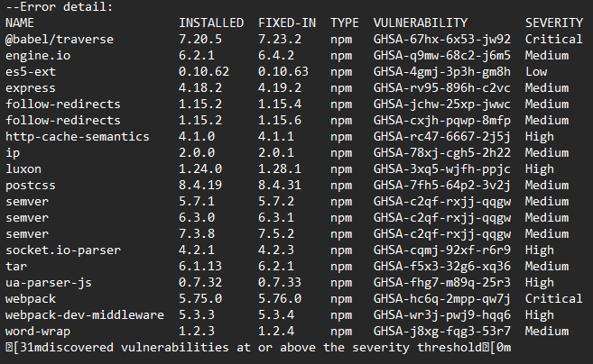
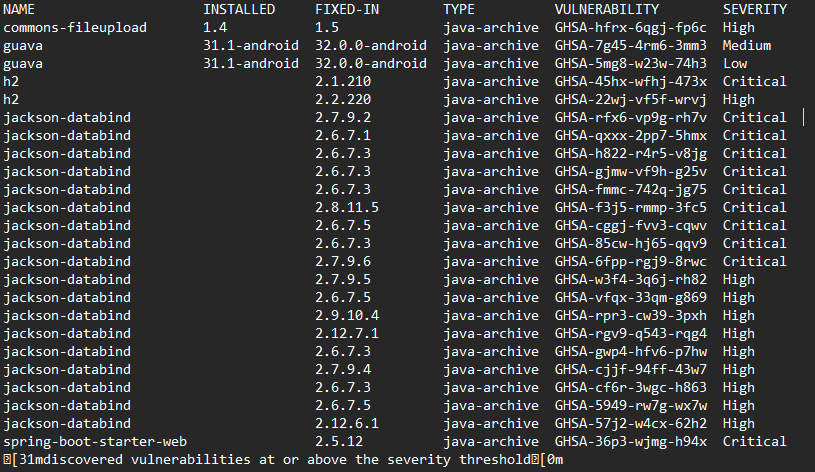

# Aplikacija slična Uber-u

## Tech Stack

### Backend:

-   Java

-   Spring Boot

-   H2 baza podataka

### Frontend:

-   Angular (koristeći material)

-   Leaflet (OpenStreet)

## Opis

Ovaj projekat je aplikacija slična Uber-u koja omogućava korisnicima da
zatraže usluge prevoza. Cilj je pojednostaviti proces transporta,
smanjiti interakciju sa vozačem i obezbediti brži, dosledniji i
sigurniji transport za korisnike. 

Aplikacija je namenjena za četiri vrste korisnika:

1.  **Neregistrovani korisnici** - Mogu da pregledaju osnovne
    informacije o aplikaciji i unesu lokacije polaska i odredišta kako
    bi dobili procenjeno vreme i troškove transporta.

2.  **Registrovani korisnici** - Mogu da zatraže vožnje, primaju
    obaveštenja u realnom vremenu o statusu svoje vožnje, prate vozila
    na mapi, ocenjuju vozače i vozila nakon vožnje, pristupaju istoriji
    svojih vožnji. Takođe, mogu da zakazuju buduće vožnje kako bi ih
    prioritetno dobili tokom špica. Dodatno, korisnici mogu definisati
    omiljene rute za brzi izbor i koristiti dugme PANIC tokom vožnje
    kako bi obavestili dispečera o bilo kakvim problemima. Takođe, mogu
    ažurirati informacije o svom profilu i kontaktirati podršku za
    pomoć.

3.  **Vozači** - Automatski im se dodeljuju vožnje od strane sistema i
    dobijaju lokacije polaska i odredišta. Mogu da uređuju svoj profil,
    pregledaju istoriju svojih vožnji, generišu izveštaje o vožnjama i
    pristupaju dugmetu za PANIC. Vozači mogu ručno promeniti svoj status
    dostupnosti a biće označeni kao nedostupni ako pređu 8 radnih sati u
    danu.

4.  **Administratori** - Mogu da kreiraju vozačke naloge, pregledaju
    informacije i status vožnje bilo kog vozača, pristupe istoriji
    vozača i generišu izveštaje. Administratori mogu blokirati korisnike
    i vozače, odgovarati na PANIC obaveštenja i pružati podršku uživo
    putem četa 24/7.

## Članovi razvojnog tima

-   Maja Varga SV54/2020

-   Marko Milijanović SV56/2020

-   Vuk Radmilović SV73/2020

## Defekti

-   **Resetovanje lozinke bez provere broja pokušaja**:

    -   Sistem omogućava resetovanje lozinke bilo kom korisniku ako se
        unese validan ID korisnika i kod za reset. Nedostaje provera
        koliko puta je korisnik pokušao da unese kod za reset.

    -   **Preporuka**: Implementirati proveru broja pokušaja i
        ograničiti broj neuspešnih pokušaja na 3, nakon čega bi se
        generisao novi kod za reset.

-   **Nedostatak autorizacije u endpointima**:

    -   Postoji ogroman broj endpointova koji nemaju pravilno odrađenu
        autorizaciju. Postoje čak i neki endpointovi koji su duplikati,
        gde postoji i verzija sa autorizacijom i bez autorizacije, i
        moguće je koristiti i jednu i drugu. Između ostalog ovo je zbog
        toga što se projekat radio i za angular frontend i za mobilnu
        aplikaciju, gde je negde korišćen JWT token a negde ne, i gde je
        to sve na kraju usklađeno na veoma nebezbedan način. Zbog ovoga
        je izložena ogromna količina privatnih podataka i cela
        aplikacija je kompromitovana

    -   Neki primeri uočenih endpointova bez autorizacije:

        -   findRides -- moguće je pronaći istoriju vožnje bilo kog
            korisnika

        -   izlistavanje svih korisnika registrovanih u sistemu

        -   nalaženje podataka o korisniku preko njegovog email-a

        -   nalaženje svih informacija o korisniku preko id-a

        -   menjanje informacija o korisniku

        -   nabavljanje i menjanje vozačevih dokumenata

        -   nabavljanje i slanje poruka

        -   mogućnost ostavljanja recenzija za tuđe vožnje

        -   mogućnost otkazivanja tuđih vožnji

    -   **Preporuka**: Implementirati mehanizme autorizacije za sve
        endpointe kako bi se osiguralo da samo autorizovani korisnici
        mogu pristupiti svojim privatnim informacijama.

-   **Nebezbedno slanje lozinki preko HTTP**:

    -   Lozinke se šalju preko nebezbedne HTTP veze, što ih čini
        podložnim krađi tokom procesa prijave korisnika.

    -   **Preporuka**: Implementirati sigurnu HTTPS vezu za sve
        komunikacije koje uključuju slanje osetljivih podataka, kao što
        su lozinke korisnika.

-   **Nedostatak validacije prilikom slanja poruka**:

    -   Nedostaje bilo kakve validacije prilikom slanja poruka. Između
        ostalog, to omogućava korisnicima da lažiraju vreme slanja
        poruka i identitete pošiljalaca i primaoca.

    -   **Preporuka**: Implementirati rigoroznu validaciju prilikom
        slanja poruka kako bi se osigurali integritet i verodostojnost
        komunikacije između korisnika.

-   **Mail i lozinka za slanje mailova su izloženi**

    -   Osetljivi podaci poput maila i lozinke za slanje mailova su
        izloženi riziku jer su hardkodovani u konfiguracionom fajlu
        application.properties, umesto da se čuvaju kao environment
        varijable.

    -   **Preporuka**: Premestiti osetljive podatke (mail i lozinka) iz
        application.properties u environment varijable radi bolje
        sigurnosti.

-   **Secret za JWT izložen**

    -   Tajni ključ (Secret) za JWT (JSON Web Token) je hardkodovan
        direktno u kodu umesto da se čuva kao environment varijabla.

    -   **Preporuka**: Premestiti tajni ključ za JWT iz koda aplikacije
        u environment varijablu radi poboljšanja sigurnosti.

-   **Linter**

    -   Korišćen je MegaLinter.

    -   Linter je otkrio različite probleme sa stilom koda kao što su
        nekonzistentnost u razmacima, imenovanju, neadekvatno korišćenje
        tipova i ===/==, nekorišćenje readonly ključne reči kad god je
        to moguće.

    -   **Preporuka**: Koristiti linter alate kao što su ESLint ili
        TSLint kako bi se automatski otkrili i ispravili problemi sa
        stilom koda. Definisati jasna pravila o stilu koda i insistirati
        na njihovom poštovanju.

    -   Postoji duplirani kod na beku, isti DTO-ovi se koriste na više
        mesta, postoji više verzija istih fajlova, što otežava
        održavanje i povećava mogućnost grešaka.

    -   **Preporuka**: Refaktorisati kod kako bi se eliminisali
        duplikati i nepotrebne verzije fajlova. Koristiti principe DRY
        (Don\'t Repeat Yourself) i SOLID kako bi se poboljšala
        modularnost i čitljivost koda.

    -   Postoje neiskorišćeni importi, nedostaju dokumentacije, linije
        koda su predugačke, imena promenljivih i funkcija su
        nekonzistentna, a magični brojevi se koriste direktno u kodu.

    -   **Preporuka**: Očistiti kod od neiskorišćenih importa, dodati
        dokumentacije tamo gde je potrebno, smanjiti dužinu linija koda,
        uskladiti imena promenljivih i funkcija prema dogovorenim
        konvencijama, i izbegavati korišćenje magičnih brojeva.

-   **Ranjivosti**

    -   Otkrivene su ranjivosti u
        zavisnostima aplikacije koje imaju ozbiljne posledice na
        sigurnost.

    -    
    -   **Preporuka**: Ažurirati zavisnosti
        aplikacije na ispravljene verzije koje su dostupne i koje
        popravljaju otkrivene ranjivosti. Redovno pratiti bezbednosna
        ažuriranja i primenjivati ih u kodu.

## Vreme

-   Analizu ovog koda je izvršio Vuk Radmilović za oko 3 sata
