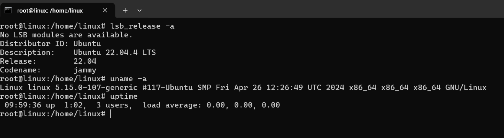

# Analiza okruženja na kojem je pokrenuta *Enginx* aplikacija

-   Na serverskoj mašini je instaliran Ubuntu 22.04.4 LTS.
  
  
-   SSH komunikacija sa serverom se autentifikuje uz pomoć ključeva
  
  
-   Aplikacija je pokrenuta i moguće joj je pristupiti sa host računara na portu 8

  
-   Operativni sistem je LTS, što znači da je redovno ažuriran. Sistem radi malo jače od sat vremena, i
    u tom vremenu nije izdat nijedan *patch*.
  
  
-   Format vremena je UTC i ne uzima u obzir pomeranje sata.
  
  
-   Tokom instalacije je izabrana minimalna instalacija i nisu prihvaćeni nikakvi dodatni paketi. Naknadno su instalirani paketi potrebni za funkcionisanje aplikacije i pokretanje komandi iz ovog zadatka.
  
  
-   Postavljena su samo podrayumevana *firewall* pravila, što nije optimalno
  
  
-   Korektno konfigurisan podrazumevani *file sistem*
  
  
-   Pristup osetljivim fajlovima u folderu je dozvoljen isklju;ivo root nalogu i sistemski generisanim ulogama.
  
  
-   *Setuid* fajlovi su validni i pristup im ima isključivo vlasnik sistema.
-   Samo root user ima uid 0.
  
  
-   Šifra za korisnika *linux* je hashovana sa SHA512 algoritmom koji nije najsigurniji
  
  
-   Lista procesa, uključujući i one vezane za nginx
  
  
-   Udp i tcp procesi
  
  
    
