# Analiza okruženja na kojem je pokrenuta *Express* aplikacija

-   Za operativni sistem na serverskoj mašini je iskorišćen Linux Ubuntu
    22.4 LTS (***server install image***). Postavljena je konfiguracija
    za SSH uz pomoć ključeva. Napravljen je poseban korisnik sa posebnim
    pravima pristupa za aplikaciju. Aplikacija je pokrenuta i uspešno je
    poslat zahtev sa lokalnog računara.

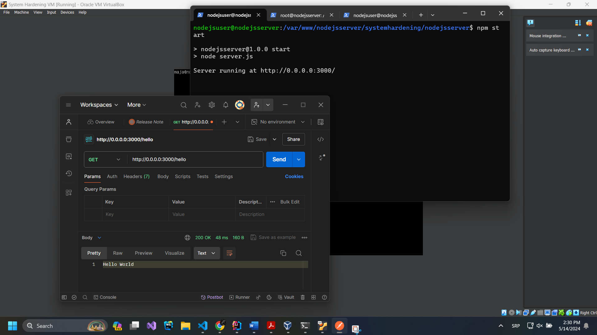

-   Operativni sistem je LTS (*Long Term Support*) tipa, što znači da je
    redovno ažuriran i aktivno se održava. Sistem radi svega par sati, i
    u tom vremenu nije izdat nijedan *patch* za njega. Na listi poznatih
    ranjivosti za ovaj operativni sistem nije pronađena nijedna
    ranjivost koja se odnosi na pakete instalirane na ovoj konkretnoj
    mašini.

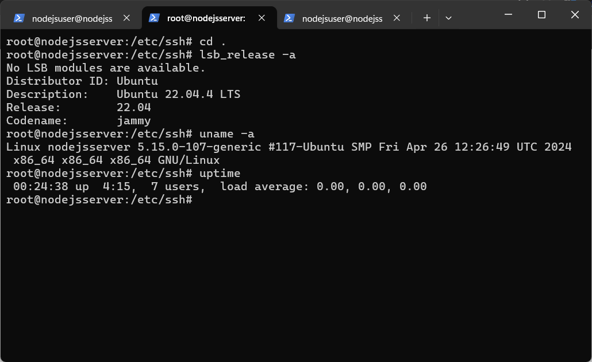

-   Operativni sistem rukuje sa UTC formatom vremena, koji ne uzima u
    obzir pomeranje sata (*daylight savings*). Ima korektno
    konfigurisanu konekciju sa NTP serverom.

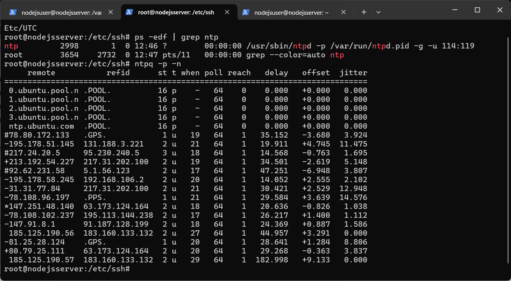

-   Skoro svi paketi koji su instalirani su vezani za operativni sistem.
    Paketi koji se vezuju za aplikaciju su **nodejs** i **npm.** Pošto
    je instalacija bila specijalizovana za upotrebu mašine kao servera,
    nema nepotrebnih biblioteka u vezi grafičkog interfejsa.

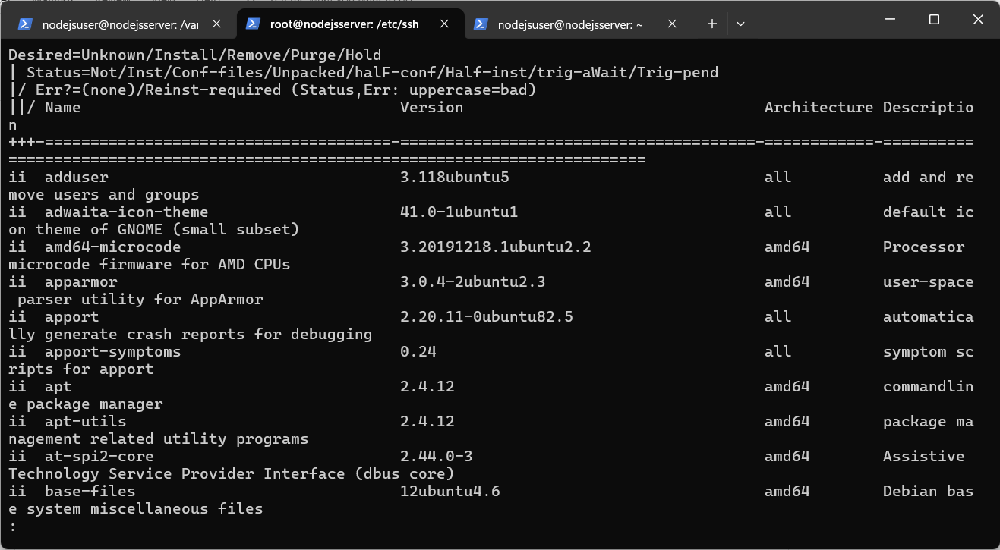

-   Na operativnom sistemu je podešen **rsyslog** kao sistemski loger.
    Međutim, analizom njegovog konfiguracionog fajla je zaključeno da
    nije aktivan, tj. ne prihvata/generiše logove.

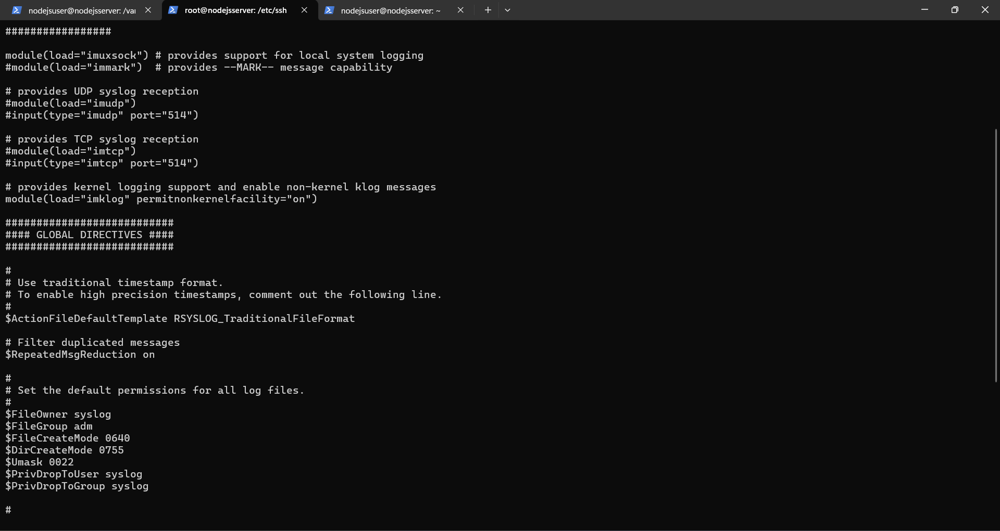

-   Na operativnom sistemu nije podešen *firewall* ni za IPv4, ni za
    IPv6 mrežnu komunikaciju. Ovo predstavlja veliki sigurnosni propust,
    pošto će aplikacija u realnoj situaciji biti otvorena konekcijama sa
    interneta. Kako najverovatnije neće biti korišćen, IPv6 se može
    isključiti, a za IPv4 je potrebno podesiti *firewall*.

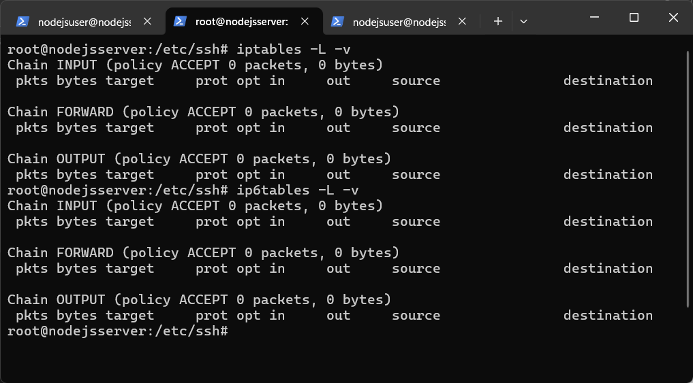

-   Fajl sistem je korektno podešen i ne sadrži *noatime* particije
    (svaka particija beleži poslednje vreme pristupa fajlu).

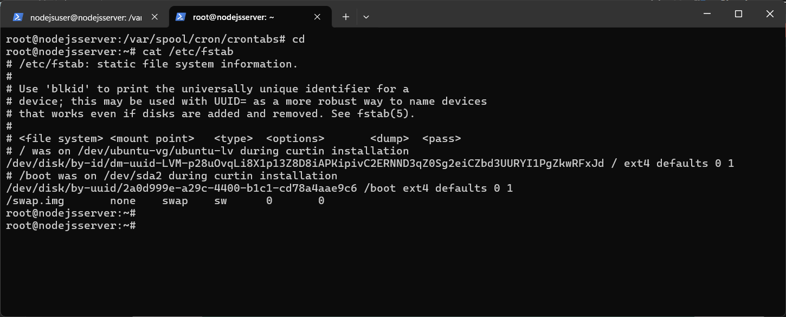

-   Pristup osetljivim fajlovima u **/etc** folderu je dozvoljen samo
    *root* nalogu i sistemski generisanim ulogama.

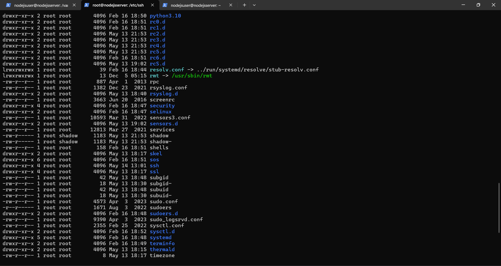

-   Fajlovi koji su *setuid* tipa (pristupa im se sa vlasničkim
    privilegijama) su validni i generisani od strane operativnog
    sistema. Pristup fajlovima je takođe validan (nijedan korisnik osim
    vlasnika/sistemskih uloga nema pristup njima). Fajlovi koje svi
    korisnici mogu čitati/pisati u njih su takođe sistemski i vezuju se
    za interni **AppArmor** proces koji nije maliciozan. Pristup ovim
    fajlovima je takođe validan. Operativni sistem nema *backup*. Ovo
    nije dobra praksa, s ozbirom na to da neće biti u stanju da se
    oporavi u slučaju otkaza.

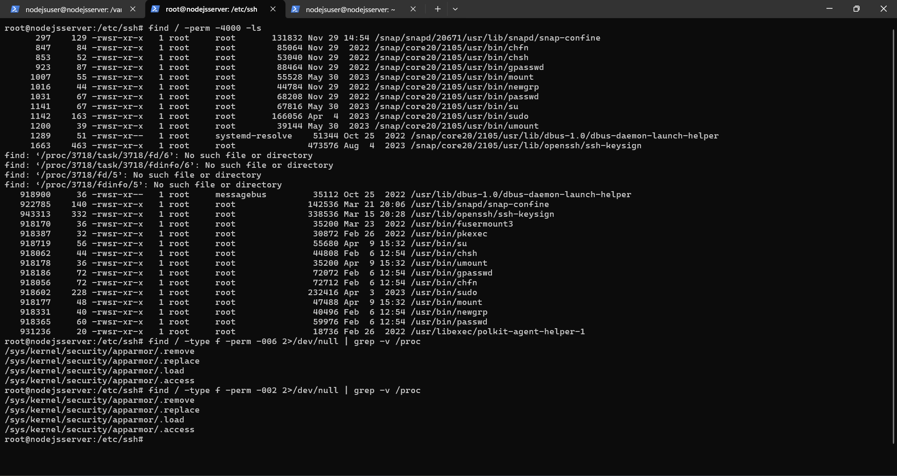

-   Operativni sistem sadrži samo jednog korisnika čiji je *uid* 0, i to
    je *root,* što jeste korektno. Pristup *bash*-u imaju samo nalozi
    koji su kreirani od strane autora (na slici *maja* i *nodejsuser*
    koji se koristi posebno za pokretanje *Express* aplikacije) i
    *root.* Lozinke su podrazumevano heširane koristeći **yescrypt**.
    Popularan softver za razbijanje heševa *hashcat* ga ne može razbiti,
    dok *John-The-Ripper* teoretski može, ali u kombinaciji sa
    *rockyou.txt* fajlom je jako sporo na lokalnim mašinama. Stoga, ovaj
    algoritam jeste dobra opcija za heširanje lozinki.

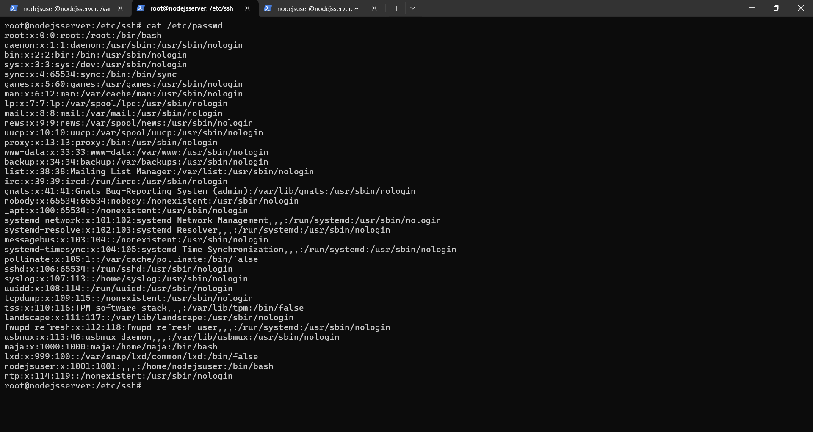

**Međutim,** primećeno je da je lozinka za *maja* nalog hešovan sa
SHA512 algoritmom (prefiks \$6\$). Ovaj format podržavaju i *hashcat* i
*John-The-Ripper*, stoga je nju moguće razbiti (sa *rockyou.txt*
fajlom) - iako je računarski vrlo zahtevno.

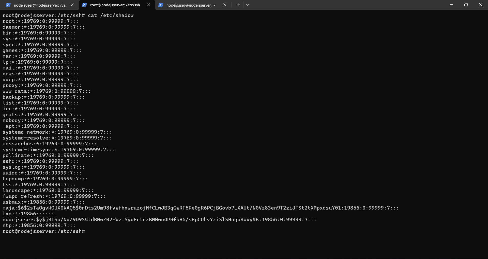

-   Jedini nalog koji ima *sudo* privilegije jeste *root* nalog, što i
    jeste adekvatno podešeno.

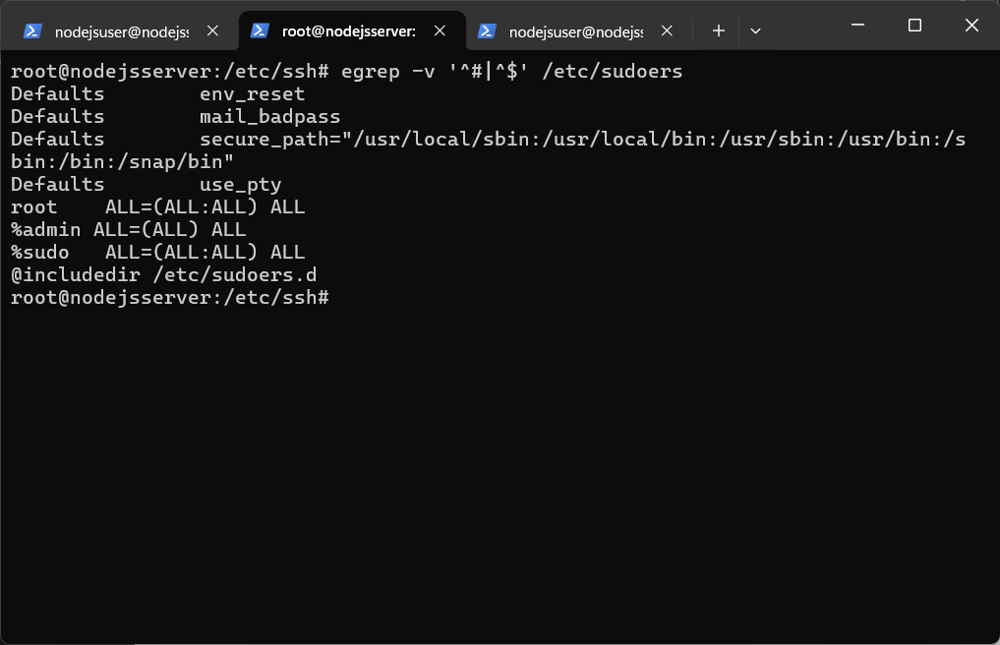

-   U listi procesa u izvršavanju se nalaze i oni vezani za aplikaciju
    na posebnom nalogu (*nodejsuser*).

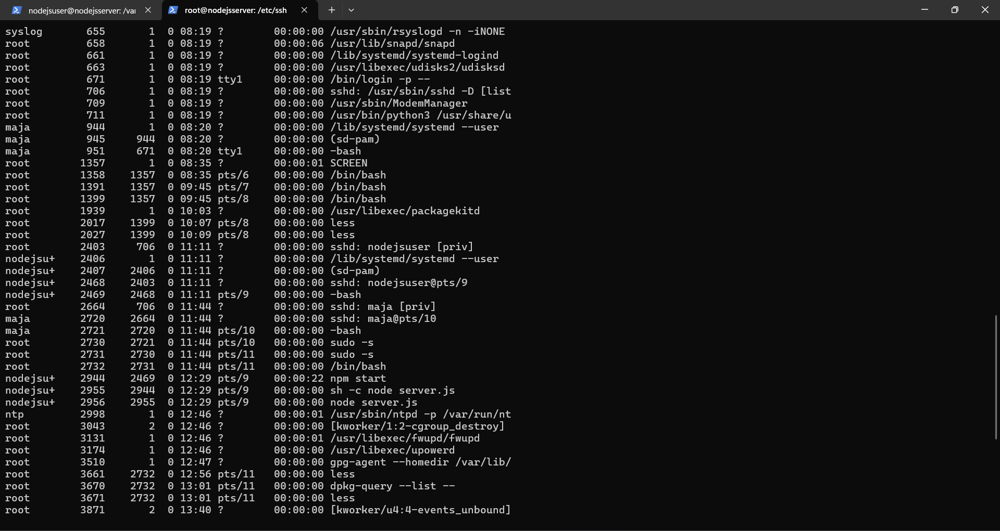

-   Ti procesi jesu pokrenuti od strane autora i validni su. Proverom
    konekcija ka mašini je ustanovljeno da *node* proces osluškuje
    zahteve na portu 3000 (što jeste korektno i postavljeno od strane
    autora). Takođe, postoji aktivna SSH konekcija na portu 22, što je
    konekcija između lokalne i serverske mašine. NTP koristi UDP kako bi
    sinhronizovao lokalno vreme. Nisu uočene nepoznate konekcije ili
    procesi koji koriste mrežu.

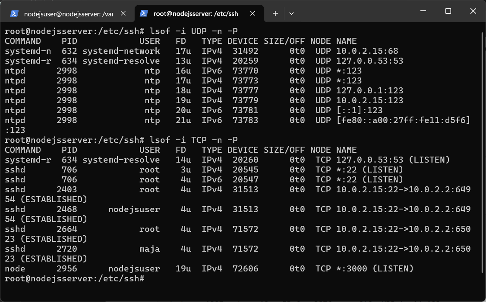

-   Na operativnom sistemu je pokrenut OpenSSH. Pregledom konfiguracije
    uočeno je da podrazumevani port nije izmenjen, što predstavlja
    potencijalni problem. *PermitRootLogin* je postavljen na
    ***prohibit-password,*** što znači da se logovanje na root nalog
    može obaviti samo uz pomoć ključeva. Ovo je bezbednije od
    dozvoljavanja logovanja sa lozinkom, ali bi trebalo u potpunosti da
    se isključi, postavljanjem ovog podešavanja na *no.* Takođe,
    dozvoljen je *TCP forwarding,* što potencijalno može dozvoliti
    zloupotrebu sistema. Ovo je takođe potrebno isključiti.

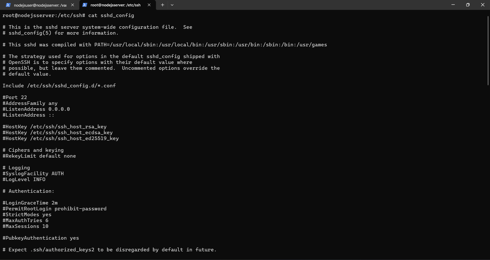
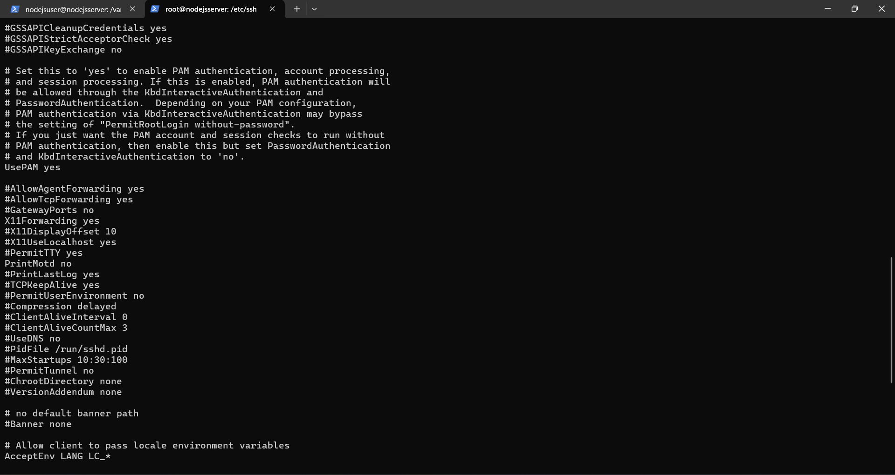

-   Ne postoji nijedan *crontab* aktiviran za na operativnom sistemu.

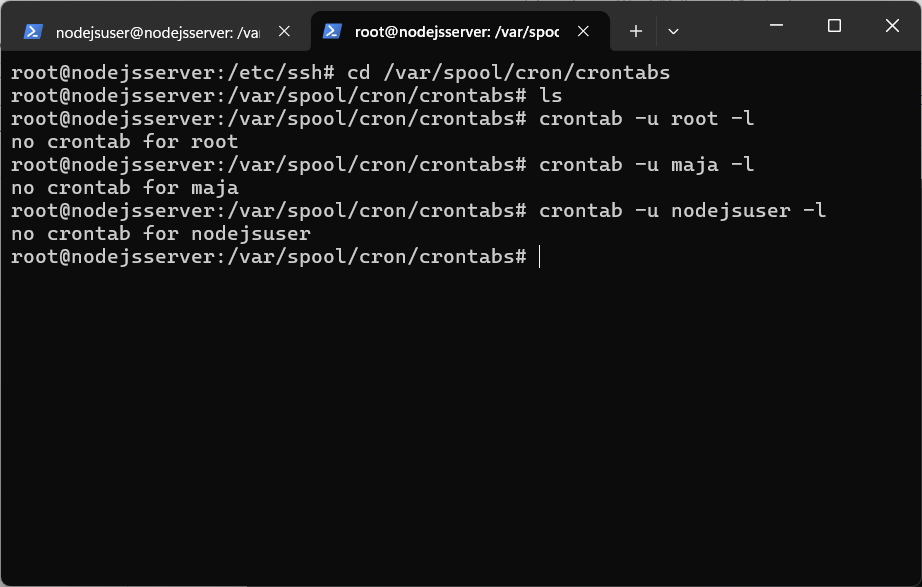
