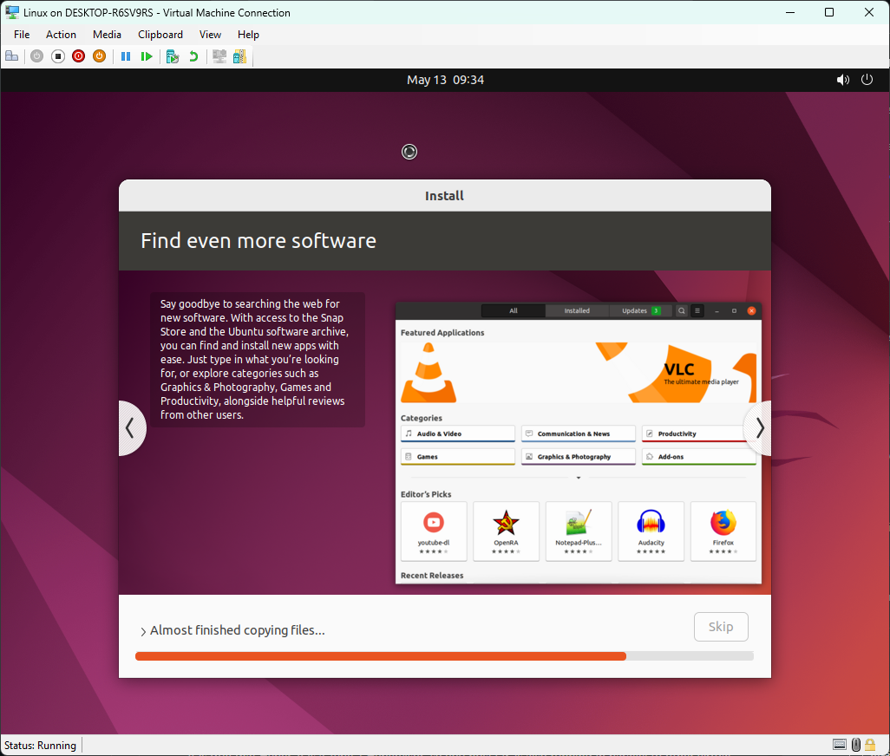
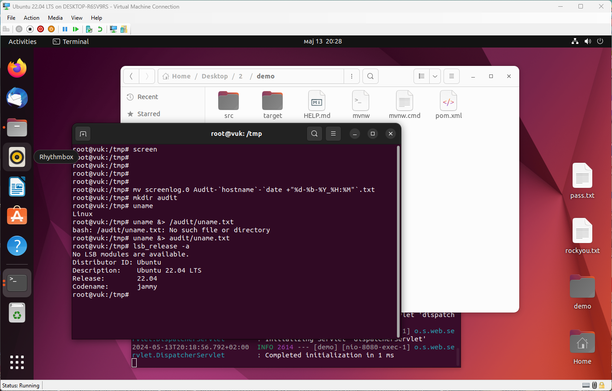

# Analiza okruženja na kojem je pokrenut Spring Boot projekat koji koristi Tomcat sa H2 bazom podataka

- Sistem je instaliran i podešen, projekat deployovan na njoj

- Priložena su 2 screenshota ali i **folder audit_vuk** u kojem su sačuvane
  dobijene informacije iz različitih upita

- Korišćen sistem je 5.15.0-27-generic \#28-Ubuntu SMP a pronađeni
  vulnerabilities se nalaze na linku:
  [<u>https://www.cvedetails.com/vulnerability-list/vendor_id-33/product_id-47/version_id-680074/Linux-Linux-Kernel-5.15.html</u>](https://www.cvedetails.com/vulnerability-list/vendor_id-33/product_id-47/version_id-680074/Linux-Linux-Kernel-5.15.html)

- Korišćen algoritam za kriptovanje šifri je yescrypt, koji nije moguće dekriptovati bez Kali OS-a

- Uptime je bio nizak označavajući da nije bilo mogućnosti da su se novi
  vulnerabilties zakrpili u međuvremenu

- Vremenska zona koristi daylight saving što znači da ima time skipove
  što nije optimalno (ne možemo precizno porediti različite izvore
  logova)

- Postoji velik broj instaliranih paketa koji nisu neophodni za osnovno
  funkcionisanje aplikacije

- Rsyslog korišćen za logovanje

- Firewall nije bio podešen (pa ni za ipv6)

- Osetljivi fajlovi se ne mogu pročitati od strane korisnika

- Nema više od jednog root korisnika i samo 1 korisnik sem root-a ima
  pristup shell-u

- Yescrypt je korišćen za kriptovanje šifri (dobar skalabilan algoritam
  visoke kompleksnosti)

