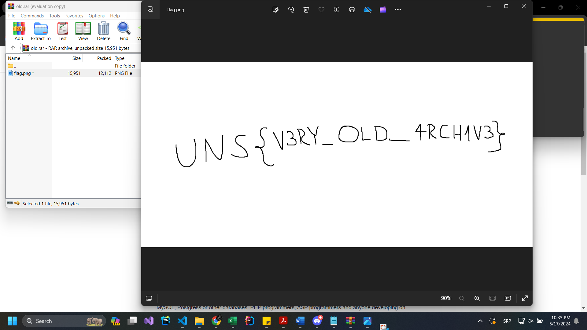

# OSINT ZADACI

## Zadatak 4 - Nigerian prince

Zadatak je rešen u svega par koraka:

-   U mejlu je pomenut (naizgled) legitiman član zakona - Senate bill
    1622 , Title 8 ; Section 308 . Izvršena je pretraga da bi se
    ustanovilo o čemu je reč

-   <https://www.vbforums.com/showthread.php?157720-Decode-the-SPAM> je
    prvi ponuđen rezultat pretrage. Na linku se nalazi link ka
    <https://www.spammimic.com/decode.shtml>. Ovo je alat koji koji je u
    stanju da dekodira sumnjive mejlove sa čudnim sadržajem u skrivenu
    poruku koja je sakrivena u tekstu

-   Rešenje zadatka je dobijeno dekodiranjem poruke na sajtu
    (**UNS{EM4IL_5P4M_AG4N?}**)

## Zadatak 5 - Educational purposes only

-   Za prvo pitanje je informacija pronađena na Wikipediji (engleska
    verzija)
    -<https://en.wikipedia.org/wiki/University_of_Novi_Sad_Faculty_of_Technical_Sciences>
    (18/05/1960)

-   Za drugo pitanje je informacija pronađena na sajtu fakulteta -
    <http://www.ftn.uns.ac.rs/n508315396/istorijat-funkcije-dekan>
    (Dragutin)

-   Za treće pitanje je stranica
    <http://www.ftn.uns.ac.rs/440025973/arhiva-vesti> prebačena na
    poslednju poznatu vest na 337. strani. Datum prve vesti je odgovor
    (18/05/2005)

-   Za četvrto pitanje je je informacija pronađena na stranici
    <http://www.ftn.uns.ac.rs/n1243898707/faculty-of-technical-sciences>
    (1999)

Konačna šifra je **18/05/1960Dragutin18/05/20051999.** Sadržaj arhive i
rešenje zadatka je dato na slici ispod (**UNS{V3RY_OLD_4RCH1V3}**).

## Zadatak 6 - Pixel perfect

-   Kolega koji voli da fotografiše je ostavio sliku rekavši da želi da mi kaže nešto bitno. Od tada ga nema.

-   Na slici je prikazan PMF, a reverse image search nas vodi do originalne slike

-   Zaključujemo da je naš kolega upisao PMF i da je rešenje UNS{PMF}

-   Na njoj vidimo i da je autor slike Marko Gordić 2022.

-   Ulaženjem na profil Marka Gordića i gledajući slike koje je postavljao u skorije vreme, vidimo da je naš kolega sada u Norveškoj

-   Nadajmo se da mu je tamo lepo

## Zadatak 7 - The Queen of the Ocean

-   Kraljica okeana je 2020. uhvaćena i tagovana. Zanima nas kada je poslednji put pingovana.

-   Google search za "Queen of the ocean captured 2020" daje nam yahoo news vest o hvatanju 50 godina stare velike bele ajkule <https://sg.news.yahoo.com/50-old-great-white-shark-082339136.html?guccounter=1>

-   U toj vesti se pominje da je njeno ime Nukumi, a pretragom za Nukumi dolazimo do sajta na kojem možemo videti put koji je ajkula prešla plivajući u okeanu kao i njen poslednji ping <https://www.ocearch.org/tracker/detail/nukumi> 

-   Poslednji tag i rešenje jeste RC15{Apr 11, 2021, 3:03:07 PM}

## Zadatak 8 - Squid Game Invitation

-   Pretragom korisničkog imena squidgameph1337 na github-u pronalazimo korisnika sa jednim javnim repozitoriumom <https://github.com/squidgameph1337>
  
-   U tom repozitorijumu se nalazi jednostavna web aplikacija koja na index.html stranici sadrži traženi flag
  
-   NAVY{h4v3_y0u_3v3r_w4tched_!t?}
